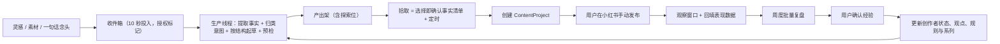

# TopicAI

> 面向小红书知识/经验型创作者的 AI 原生内容操作系统：把灵感交给它，把时间还给你。

[](https://www.python.org/)
[](https://fastapi.tiangolo.com/)
[](https://react.dev/)
[](https://www.typescriptlang.org/)
[](https://github.com/wu908/topicai/actions/workflows/ci.yml)
[](./LICENSE)

TopicAI 把"选题、写作、发布、复盘"收敛成一条**异步创作循环**：创作者随时把灵感和素材丢进收件箱就去忙别的；AI 在信任边界内自主生产出可发布的内容（含逐条溯源的事实清单与结构预检）；创作者回来只需要做三件事——**挑哪条、什么时候发、每周花几分钟确认复盘**。AI 永远只提议；事实、公开范围、发布动作和长期经验四个决策始终由用户亲手确认。

## 产品定位

- 平台：小红书。
- 用户：已开始创作或准备稳定创作的知识/经验型个人创作者。
- 内容意图：`解决`（solve）、`分享`（share）、`记录`（record）——每篇内容单独认定，不给创作者贴标签。
- 内容形式：以图文笔记为主，记录型内容可以规划 Vlog，但不包含视频剪辑。

产品核心原则：

1. **收发散之权在人，守质量之责在 AI。** AI 负责理解素材、发现证据缺口、按结构生产候选；用户负责确认事实、公开范围、发布动作和长期经验。
2. AI 不自动发布、不自动公开私密素材、不覆盖已确认版本、不虚构经历。
3. 结构预检是生产的承重墙：钩子/要点/结尾不齐、正文过短、没有可溯源事实的产出**不会进入产出架**。
4. 复盘区分事实、可能原因和下一轮实验，"拿不到数据"也是合法结论（不补 0），未经确认的结论不会进入长期画像。

## 核心流程



同时保留**同步急稿通道**（现有引导流）：现在就想发的时刻，三步直达可发布候选，全部 HumanGate 不减。

## 已实现能力

### 异步创作循环（Spec-013，最新）

- **收件箱**：五类输入（文字/图片/语音/链接/念头），幂等提交，授权标记（`publishable`/`private`，私密素材永不进入生产）。
- **生产线程**：确定性骨架生产（无模型可用，接模型后走证据约束生成）；每批含 1 个**探索位**（尝试新方向，落选不计入能力信任）；货架限流；7 天未拾取自动过期回灵感池；生产全程写 `AITrace`。
- **结构预检（PublishCheck）**：钩子/要点/结尾大纲、标题、正文长度、事实溯源逐项检查——未通过不产 ready，素材留在收件箱等补料。
- **拾取**：选择即确认——事实清单逐条溯源到收件箱素材，当场可改；同时确认意图与发布时点，经正式服务入口创建 `ContentProject` 并锁定工作意图。
- **周度复盘**：一屏对照"发布判断 vs 实际表现"，按阶段引导（待回填/待盲评/待确认/已确认），数据留在既有 HumanGate 管线内。
- **证伪线度量**：维护时长、发布数、落选归因——为"这个方向是否成立"提供客观证据。

### AI 行动编排

- `CreatorState`：维护用户事实、AI 推断、已验证经验、未知项和自动化信任状态。
- `NextBestAction`：为当前用户或项目选择一个可解释的下一步。
- `HumanGate`：在意图、事实、候选版本、发布和长期经验写入前暂停确认。
- `Capability Trust`：某项 AI 能力在 ≥3 次被接受且无未解决纠正后才可自动准备可逆工作；`AUTOPILOT_TO_READY` 需显式同意 + 信任达标，永不授权受保护决策。
- `AITrace`：记录 AI 使用的证据、置信度、限制、执行结果、用户决策和降级路径。
- 无可用模型时保留手动路径，不阻塞内容项目继续推进。

### 意图驱动内容项目

三种意图使用不同的创作和复盘逻辑：

| 内容意图 | 内容结构 | 重点观察信号 |
| --- | --- | --- |
| 解决 | 问题、方法、案例、结果 | 收藏、问题评论、关注变化 |
| 分享 | 事件、感受、观点、意义 | 共鸣评论、互动质量、关注变化 |
| 记录 | 起点、过程、转折、结果 | 阅读完成、持续关注、系列延续 |

内容项目覆盖：意图确认、证据采访、候选内容、分段接受/拒绝/替换、版本恢复、发布假设、发布检查、发布记录、表现快照、盲评、观察任务和经验确认。

### 发布、素材与账户控制

- 发布检查绑定锁定版本，过期或未确认风险不能记录发布；正文、配图方案可分别复制或导出。
- 表现截图作为敏感素材上传；视觉模型只预填指标，必须逐项确认后保存。
- 素材支持文本、链接、图片和文档，带隐私级别、项目引用、复用记录及锁定版本删除影响保护。
- "我的"提供周目标、内容策略、AI 能力状态、HumanGate 保护的数据导出与账户删除。

### 个性化资产

`Evidence`、`CreatorRule`、`CreatorViewpoint`、`CreatorSeries`、`ContentOpportunity`、`ContentGenome`——只有用户确认过的经验才进入长期上下文，形成可审计的个性化基础。

## 设计语言（琉璃 Lumen）

前端遵循仓库根的 [`DESIGN.md`](./DESIGN.md)：冷调虚幻空间上的半透明白玻璃，浅色双边界，冰蓝光仅存在于灯带/弧环/辉光；衬线已移除；对话交互为**悬浮球 + π 形灯框 + 独立输入泡**（首启灯带入场动画仅播放一次，闲置渐隐至只剩气泡）。规范含 Pre-Flight 清单，UI 走查逐项过。

## 当前边界

当前版本不包含：

- 自动发布或自动操作小红书账号；发布永远手动，"定时"只是提醒。
- 小红书官方数据自动同步；表现数据手动回填。
- 视频剪辑、音频处理和多平台分发。
- 团队、MCN、矩阵账号和直播电商工作流。
- "一键爆款"、流量预测、爆款评分或审核必过承诺；结构预检只做定性结构检查。
- 机会只来自用户自身素材、历史、系列与已确认经验，不接入任何热点数据源。

## 技术架构

```text
TopicAI
├── backend/
│   ├── app/api/v2/              # 唯一公开 API：认证、内容项目、异步循环、复盘与个性化资产
│   ├── app/services/            # 编排、异步循环、预检、证据、版本、复盘、规则和系列服务
│   ├── app/data/migrations/     # SQLite 追加式迁移（000 → 051）
│   └── tests/                   # pytest（410 passed，覆盖率 89.37%，门禁 80%）
├── frontend/
│   ├── src/pages/               # 创作循环 / 内容 / 机会 / 素材 / 我的 / 引导
│   ├── src/features/content/    # 采访、候选内容、复盘、观点和系列组件
│   ├── src/services/api/v2/     # v2 API 客户端（类型化契约）
│   ├── e2e/                     # Playwright（starter / intent-loop / async-loop）
│   └── vitest.config.ts         # 223 tests，覆盖率门禁 lines80/funcs66/branch66/stmt76
├── DESIGN.md                    # 「琉璃 Lumen」设计规范（令牌 + 组件 + Pre-Flight）
├── docs/                        # 产品文档、ADR、审计报告、狗粮测试协议、交接
└── specs/                       # SpecKit 规格（008 → 013）
```

主要技术：

- 后端：FastAPI、Pydantic 2、SQLAlchemy 2、SQLite/aiosqlite、OpenAI-compatible SDK（供应商中立）。
- 前端：React 19、TypeScript 6、Vite 8、MUI 5、Zustand、GSAP（动效编排）。
- 测试：pytest、Vitest（双端覆盖率门禁）、Testing Library、Playwright。
- 本地数据：SQLite WAL；部署：Docker Compose。

## 快速开始

### 环境要求

- Python 3.12+、Node.js 22+、pnpm 10+
- 一个强随机 `JWT_SECRET_KEY`
- 可选：OpenAI-compatible 模型凭据（不配置时系统降级到确定性路径，核心流程完整可用）

### 1. 启动后端

```powershell
cd backend
python -m venv .venv
.\.venv\Scripts\Activate.ps1
pip install -r requirements-dev.txt
Copy-Item .env.example .env
```

编辑 `backend/.env`，至少设置 `JWT_SECRET_KEY`；可选配置 `LLM_BASE_URL` / `LLM_API_KEY` / `LLM_MODEL`。

```powershell
python -m uvicorn main:create_app --factory --host 127.0.0.1 --port 8000 --reload
```

- API：<http://127.0.0.1:8000> · Swagger：<http://127.0.0.1:8000/docs> · 健康检查：<http://127.0.0.1:8000/api/v2/health>

### 2. 启动前端

```powershell
cd frontend
pnpm install
pnpm dev
```

应用地址：<http://127.0.0.1:5173>

### Docker Compose

```powershell
Copy-Item backend\.env.example .env   # 编辑根 .env 设置 JWT_SECRET_KEY 等
docker compose up --build -d
```

前端 <http://localhost> · 后端 <http://localhost:8000>

## 测试与质量检查

```powershell
# 后端：与 ci-backend 等价（覆盖率门禁 80%，当前 89.37%）
cd backend
python -m pytest -q -k "not test_scenario_g_coverage_gate" `
  --cov=app --cov-report=term-missing --cov-fail-under=80 --basetemp=.ci-tmp

# 前端：lint + 测试（含覆盖率门禁）+ 构建
cd frontend
pnpm lint
pnpm test
pnpm build

# E2E：先手动启动后端于 8765，Playwright 自动拉起 Vite
pnpm exec playwright install chromium
pnpm exec playwright test e2e/async-loop.spec.ts e2e/starter-flow.spec.ts e2e/intent-driven-loop.spec.ts
```

面向 `main` 的 Pull Request 必须通过：`ci-backend`（测试 + 覆盖率 + ruff/mypy/Bandit + v2 完整性 + UTF-8 检查）与 `ci-frontend`（lint + 覆盖率门禁 + 构建 + 真实栈 Playwright 回归）。

## 关键文档

- [DESIGN.md](./DESIGN.md)：「琉璃 Lumen」设计规范（单一设计权威）
- [AI-Native 异步创作循环方案](./docs/ai-native-async-creation-plan-2026-08-29.md)：七轮质询决议的完整产品方案
- [狗粮期测试协议](./docs/testing/dogfood-falsification-protocol.md)：两周真实创作者证伪测试
- [安全审计](./docs/reviews/security-audit-oss-2026-08-31.md) / [测试套件审计](./docs/reviews/test-suite-audit-2026-08-31.md)（2026-08-31）
- [全景复盘](./docs/topicai-project-development-retrospective-2026-08-18.md)：项目演进、决策与教训
- [Spec 008–013](./specs/)：内容项目 MVP / AI 原生行动闭环 / 意图模型 / 异步创作循环
- [ADR](./docs/adr/)：内容意图为根 / 约束 AI 编排与学习 / 历史迁移风险

## 开发状态

项目处于 **Phase 2 狗粮期**：技术 MVP 已完成并通过系统加固（两轮过度工程审计、全库安全审计、测试套件审计），正在用两周真实创作者证伪测试校准方向——三条证伪线（周维护时长递减 / ≥3 条真实发布 / ≥2 次依赖时刻）两条不达即回炉方向而非堆功能。陪伴层（Phase 3）与成长层（Phase 4）被狗粮证据门控。

下一阶段优先验证的指标：首个项目完成率、从想法到可发布的时间、建议接受率、复盘完成率。

## License

[MIT](./LICENSE)
