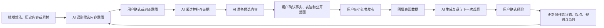

# TopicAI

> 面向小红书知识/经验型创作者的 AI 驱动内容操作系统。

[](https://www.python.org/)
[](https://fastapi.tiangolo.com/)
[](https://react.dev/)
[](https://www.typescriptlang.org/)
[](https://github.com/wu908/topicai/actions/workflows/ci.yml)
[](./LICENSE)

TopicAI 不再把选题、标题、写作、发布和复盘拆成一组彼此孤立的 AI 工具。它以 `ContentProject` 为核心，让 AI 先理解一条内容希望产生的影响，再主动准备下一步，用户只负责确认事实、表达、公开范围和长期经验等关键决策。

## 产品定位

当前 MVP 聚焦：

- 平台：小红书。
- 用户：已开始创作或准备稳定创作的知识/经验型个人创作者。
- 目标：降低持续更新中的选题、素材组织、内容推进和复盘成本。
- 内容意图：`解决`、`分享`、`记录`。
- 内容形式：以图文笔记为主，记录型内容可以规划 Vlog，但不包含视频剪辑。

产品核心原则：

1. AI 负责理解上下文、发现缺口、选择唯一下一步并准备候选内容。
2. 用户负责确认真实事实、内容意图、公开范围、发布动作和长期经验。
3. AI 不自动发布、不自动公开私人素材、不覆盖已确认版本。
4. 复盘区分事实、可能原因和下一轮实验，未经用户确认的结论不会进入长期画像。

## 核心流程



## 已实现能力

### AI 行动编排

- `CreatorState`：维护用户事实、AI 推断、已验证经验、未知项和自动化信任状态。
- `NextBestAction`：为当前用户或项目选择一个可解释的下一步。
- `HumanGate`：在意图、事实、候选版本、发布和长期经验写入前暂停确认。
- `AITrace`：记录 AI 使用的证据、未知项、决策理由和降级路径。
- 无可用模型时保留手动路径，不阻塞内容项目继续推进。

### 意图驱动内容项目

三种意图使用不同的创作和复盘逻辑：

| 内容意图 | 内容结构 | 重点观察信号 |
| --- | --- | --- |
| 解决 | 问题、方法、案例、结果 | 收藏、问题评论、关注变化 |
| 分享 | 事件、感受、观点、意义 | 共鸣评论、互动质量、关注变化 |
| 记录 | 起点、过程、转折、结果 | 阅读完成、持续关注、系列延续 |

内容项目覆盖：意图确认、证据采访、候选内容、分段接受/拒绝/替换、版本恢复、发布假设、发布记录、表现快照、盲评、观察任务和经验确认。

### 个性化内容资产

- `Evidence`：带来源、隐私级别和确认状态的事实证据。
- `CreatorRule`：从多次结果中确认的创作规则，支持版本和冲突处理。
- `CreatorViewpoint`：用户确认的稳定观点，可撤销并追踪来源。
- `CreatorSeries`：识别可持续内容系列，而不是只生成一次性选题。
- `ContentOpportunity`：基于已确认系列准备下一篇机会，接受后才创建项目。
- `ContentGenome`：聚合规则、例外、观点、系列和项目关系，形成可审计的个性化上下文。

### 旧版兼容

仓库仍保留 `/api/v1` 和部分旧页面，用于认证、画像、素材、账号及历史工具兼容。新的主链路位于 `/api/v2` 与前端 `/content` 工作台。热点推荐、爆款分析、标题优化等旧能力不是新版产品的核心流程，后续将逐步收敛到内容项目上下文中。

## 当前边界

当前版本不包含：

- 自动发布或自动操作小红书账号。
- 小红书官方数据自动同步；MVP 使用手动回填。
- 视频剪辑、音频处理和多平台分发。
- 团队、MCN、矩阵账号和直播电商工作流。
- “一键爆款”、精确流量预测或审核必过承诺。
- 将持续热点/新闻数据源作为内容推荐的必要前置条件。

`TianAPI` 等数据源仍作为旧版可选能力保留，不是意图驱动内容闭环的运行依赖。

## 技术架构

```text
TopicAI
├── backend/
│   ├── app/api/v1/              # 认证、画像、素材及旧功能兼容 API
│   ├── app/api/v2/              # 内容项目、AI 行动、复盘与个性化资产 API
│   ├── app/models/v2/           # v2 结构化契约
│   ├── app/services/            # 编排、证据、版本、复盘、规则和系列服务
│   ├── app/data/migrations/     # SQLite 增量迁移
│   └── tests/                   # pytest 测试
├── frontend/
│   ├── src/pages/Content/       # 内容项目列表与工作台
│   ├── src/features/content/    # 采访、候选内容、复盘、观点和系列组件
│   ├── src/services/api/v2/     # v2 API 客户端
│   └── src/types/contracts/v2/  # 前后端类型契约
├── docs/                        # 产品定义、架构与阶段实施记录
└── specs/                       # Spec 008/009 需求、计划、模型和任务
```

主要技术：

- 后端：FastAPI、Pydantic 2、SQLAlchemy 2、SQLite/aiosqlite、OpenAI-compatible SDK。
- 前端：React 19、TypeScript 6、Vite 8、MUI 5、Zustand、Axios。
- 测试：pytest、Vitest、Testing Library、Playwright。
- 本地数据：SQLite WAL、可选 ChromaDB、本地对象存储。

## 快速开始

### 环境要求

- Python 3.12+
- Node.js 22+
- pnpm 10+
- 一个强随机 `JWT_SECRET_KEY`
- 可选：DeepSeek 或 OpenAI-compatible 模型凭据

### 1. 启动后端

```powershell
cd backend
python -m venv .venv
.\.venv\Scripts\Activate.ps1
pip install -r requirements.txt
Copy-Item .env.example .env
```

编辑 `backend/.env`，至少设置：

```dotenv
JWT_SECRET_KEY=replace-with-a-random-secret-at-least-32-characters
```

使用 DeepSeek：

```dotenv
DEEPSEEK_API_KEY=your-key
```

或使用任意 OpenAI-compatible 文本模型：

```dotenv
LLM_BASE_URL=https://your-provider.example/v1
LLM_API_KEY=your-key
LLM_MODEL=your-model
LLM_CAPABILITIES=text
```

不配置模型时，系统仍可启动，并在 AI 不可用处降级到手动路径。

```powershell
python -m uvicorn main:create_app --factory --host 127.0.0.1 --port 8000 --reload
```

- API：<http://127.0.0.1:8000>
- Swagger：<http://127.0.0.1:8000/docs>
- 健康检查：<http://127.0.0.1:8000/api/v1/health>

### 2. 启动前端

```powershell
cd frontend
pnpm install
pnpm dev
```

应用地址：<http://127.0.0.1:5173>

### Docker Compose

在仓库根目录执行：

```powershell
Copy-Item backend\.env.example .env
# 编辑根目录 .env，设置 JWT_SECRET_KEY 和可选的模型凭据
docker compose up --build -d
```

- 前端：<http://localhost>
- 后端：<http://localhost:8000>
- Swagger：<http://localhost:8000/docs>

## 测试与质量检查

```powershell
# 后端：与 ci-backend 等价，覆盖率不得低于 80%
cd backend
python -m pytest -q `
  -k "not test_scenario_g_coverage_gate" `
  --cov=app `
  --cov-report=term-missing `
  --cov-report=xml `
  --cov-fail-under=80 `
  --basetemp=.ci-tmp

# 前端：与 ci-frontend 等价
cd frontend
pnpm lint
pnpm test
pnpm build
```

面向 `main` 的 Pull Request 必须通过以下检查：

- `ci-backend`：后端测试和 80% 覆盖率门禁。
- `ci-frontend`：前端 lint、单元测试和 production build。

Playwright E2E 当前保留为本地手动检查，不属于首批强制合并门禁。

最近一次完整验证（2026-07-21）：

- 后端非递归全量：744 passed，1 deselected，覆盖率 86.67%。
- 前端全量：338 passed，2 skipped。
- 前端 lint：通过。
- Production build：通过。
- 前后端健康检查：HTTP 200。

## 关键文档

- [产品功能文档](./docs/product-functional-document.md)
- [用户视角产品介绍](./docs/product-introduction-user.md)
- [技术视角产品介绍](./docs/product-introduction-technical.md)
- [意图驱动架构](./docs/intent-driven-architecture.md)
- [意图驱动实施报告](./docs/intent-driven-implementation-report-2026-07-19.md)
- [系列延展机会阶段记录](./docs/series-extension-opportunity-stage-2026-07-21.md)
- [Spec 008：内容项目 MVP](./specs/008-content-project-mvp/spec.md)
- [Spec 009：AI 原生行动闭环](./specs/009-ai-native-action-loop/spec.md)

## 开发状态

项目处于 MVP 验证与持续重构阶段。当前重点不是继续增加独立 AI 工具，而是验证 AI 是否真正减少创作者的流程判断、上下文切换和手动决策数量。

下一阶段优先验证：

1. 首次有效行动所需时间。
2. AI 行动接受率和意图纠正率。
3. 候选内容确认率与发布后复盘完成率。
4. 规则、观点、系列和内容机会能否随真实结果持续提升个性化质量。

## License

[MIT](./LICENSE)
