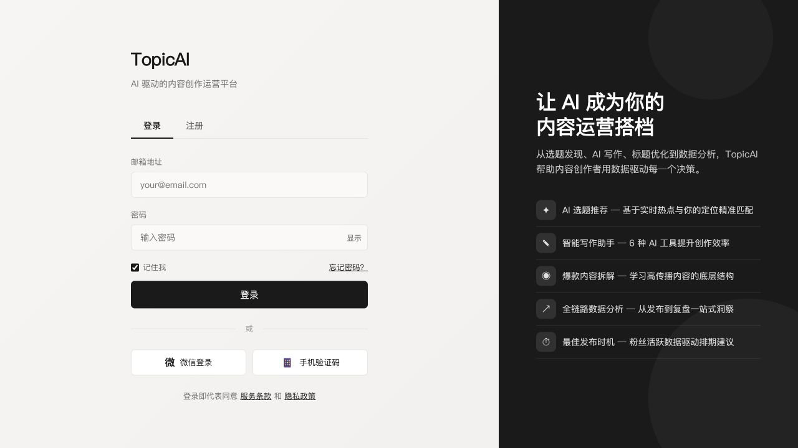
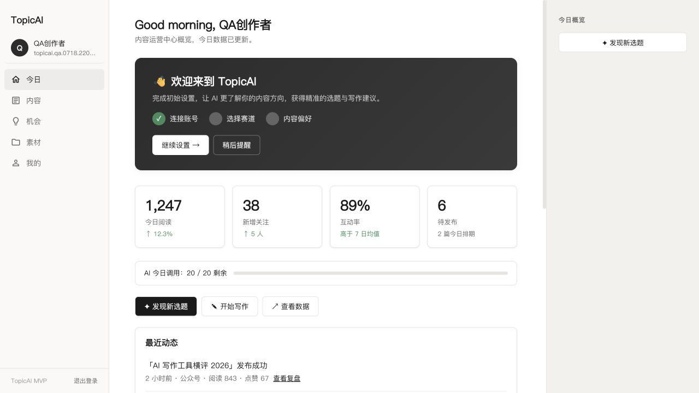
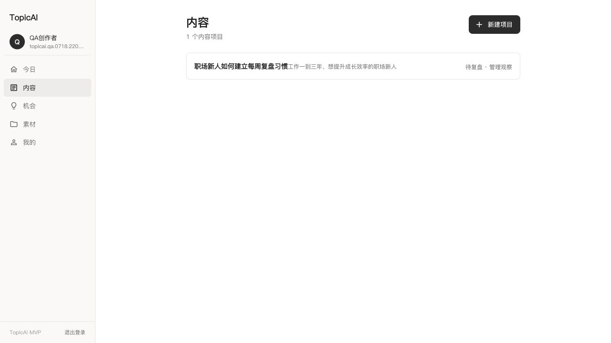
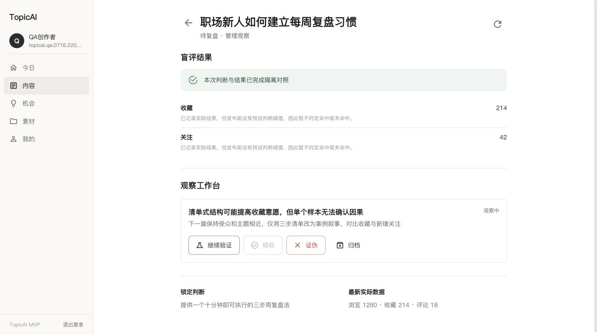
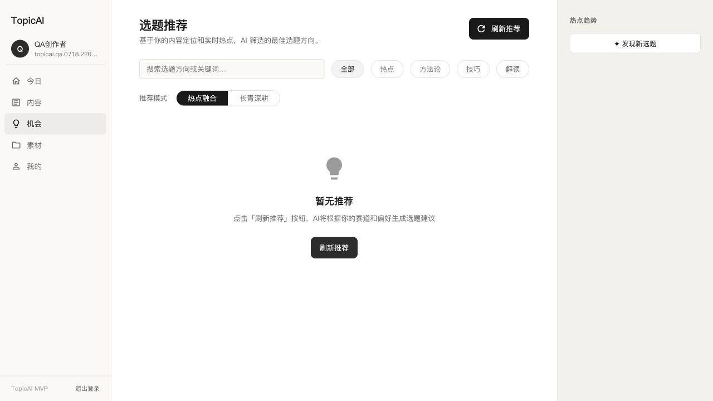
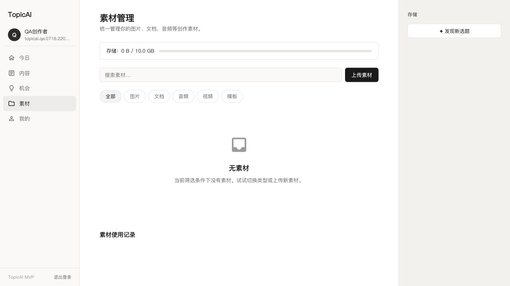
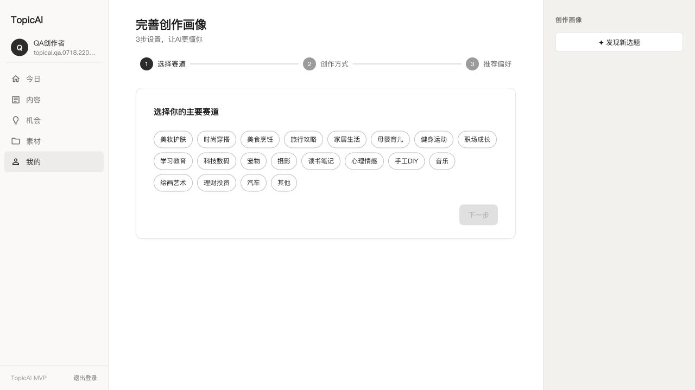
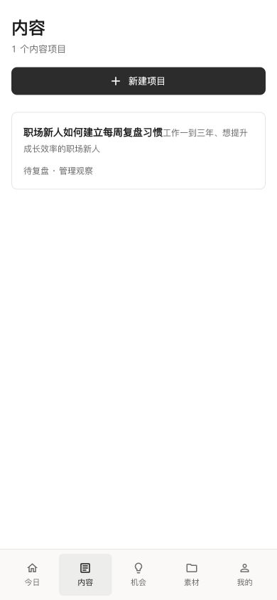

# TopicAI 前端重构现状审计

**审计日期**：2026-07-19  
**审计范围**：登录、今日、内容列表、内容项目、机会、素材、我的、移动端内容入口  
**用户目标**：让小红书知识/经验型图文创作者在尽量少做流程判断的情况下，完成稳定更新、发布验证与经验沉淀。  
**审计类型**：UX + 可见无障碍风险联合审计

## 总体结论

当前前端不是新版产品的完整实现，而是“旧工具产品外壳 + 新内容项目闭环”的混合形态。

- 新版能力已经存在于 `/content`：内容项目、发布判断、发布记录、数据快照、盲评和 Observation 可以形成真实闭环。
- 产品入口仍由旧版承诺控制：实时热点、独立 AI 工具、爆款拆解、最佳发布时间和泛化数据大屏。
- 五个一级导航只有“内容”进入了新版领域模型；“今日、机会、素材、我的”仍主要承载旧版页面与旧版数据假设。
- 问题首先是产品结构和任务模型错位，其次才是排版、视觉密度和组件样式。

因此不建议直接在当前页面上做视觉翻新。前端重构应先冻结页面职责、路由迁移和真实数据契约，再进入视觉方向选择。

## 审计步骤

### 1. 登录页：结构稳定，产品承诺错误

**健康度：阻塞重构。**

- 登录、注册、密码、记住我等基础表单结构清晰。
- 右侧明确承诺“实时热点、6 种 AI 工具、爆款拆解、最佳发布时间”，与新版的行动驱动内容经营系统不一致。
- 微信登录、手机验证码、忘记密码、服务条款和隐私政策看起来可用，但当前是未完成入口或 `#` 链接，损害信任。
- 登录页同时承担营销页职责，信息量大于 MVP 身份验证所需信息。

### 2. 今日：旧数据大屏代替下一步行动

**健康度：严重错位。**

- 页面显示阅读、新增关注、互动率、待发布、AI 调用额度等总览，但当前没有稳定真实数据来源支持这些首页指标。
- “发现新选题、开始写作、查看数据”要求用户自己选择工具，未实现唯一主要 `NextBestAction`。
- 最近动态和 AI 建议使用固定演示内容，且包含公众号、多平台、GPT-4o、微信指数、微博热搜等非 MVP 上下文。
- 右侧面板重复“发现新选题”，增加视觉占位但没有提供项目上下文。

### 3. 内容列表：领域方向正确，信息不足

**健康度：可作为重构底座。**

- 内容项目是当前唯一与新版领域模型一致的一级入口。
- 项目行能够显示目标读者、状态和唯一下一步，方向正确。
- 缺少本周计划、阻塞原因、发布时间、证据准备度、实验关系和恢复提示。
- 桌面端信息密度偏低，大面积空白没有用于项目筛选、批量扫描或周计划。

### 4. 内容项目：真实闭环成立，工作台结构仍是阶段表单

**健康度：逻辑可用，信息架构需重做。**

- 发布前判断、实际数据、盲评和 Observation 已经落在同一个项目中。
- “单样本不确认因果”的表达符合产品信任原则。
- 当前页面只展示当前阶段输出，缺少项目时间线、内容版本、证据来源、发布版本和下一次实验之间的关系。
- Observation 操作缺少“为什么现在能/不能吸收”的证据解释。
- 页面仍偏向后台表单与状态管理，不像面向创作者的持续工作空间。

### 5. 机会：旧热点推荐模型直接占据新导航

**健康度：必须替换。**

- 页面标题、说明、筛选和 CTA 都以“AI 根据实时热点刷新选题”为中心。
- “热点融合/长青深耕”是旧推荐模式，不等于新版的受众问题、创作者匹配、素材准备度、系列潜力和实验作用。
- 空状态仍要求调用 AI 生成建议，没有展示来源、证据缺口或为什么值得现在做。
- 右侧“热点趋势”再次强化运行时热点聚合心智。

### 6. 素材：能力可复用，首版产品表达过重

**健康度：基础能力可保留，页面职责需收缩。**

- 上传、搜索、类型筛选和使用记录具备基础可用性。
- 10 GB 配额、音频、视频、模板和完整 DAM 管理超出小红书知识/经验型图文 MVP 的首要需求。
- 素材没有首先按内容项目、观点、案例、证据和真实经历组织。
- 新版应优先支持项目内素材抽屉和轻量跨项目列表，底层上传/存储服务可以复用。

### 7. 我的：旧画像问卷无法支持两类用户

**健康度：必须拆分重构。**

- “选择赛道 → 创作方式 → 推荐偏好”是一次性推荐问卷，不是持续更新的 CreatorState。
- 对已有创作者，没有历史笔记导入、事实提取、画像确认和策略修正。
- 对新手，没有行动准备度、真实资产、候选方向和 14 天实验。
- 页面把“赛道选择”放在第一步，容易被理解为永久定位承诺。

### 8. 移动端内容入口：响应式基础合格，任务优先级仍弱

**健康度：布局可复用，内容层级需重构。**

- 390 x 844 下没有横向溢出，底部五导航稳定，项目卡片文本能够换行。
- “新建项目”占据首屏最强层级，但已有项目的下一步才应是高频用户的主要动作。
- 项目卡片没有在移动端突出阻塞、截止时间或继续执行入口。
- 当前移动端证明响应式壳层可复用，不代表新版任务结构已经成立。

## 已确认优势

1. React、MUI、路由懒加载、认证状态、API 客户端和响应式导航已经可复用。
2. 五导航名称与新版信息架构一致，不需要再次发明导航体系。
3. 内容项目 v2 接口与校准闭环已经提供真实后端底座。
4. 黑白中性色、8px 内圆角、图标导航和紧凑表单适合作为工作型产品的基础。
5. 移动端底部导航、内容区域宽度和基本文本换行已经通过实际视口验证。

## 最高优先级 UX 风险

| 优先级 | 风险 | 用户后果 |
|---|---|---|
| P0 | 登录和首页承诺旧工具产品 | 用户无法理解新版核心价值 |
| P0 | 今日没有唯一主要下一步 | 用户仍需自己判断该打开哪个工具 |
| P0 | 机会等同于实时热点刷新 | 产品重新被热点数据源牵引 |
| P0 | 五导航对应两套领域模型 | 页面之间上下文丢失，无法形成统一闭环 |
| P1 | 画像是一次性赛道问卷 | 新手和成长型用户都得不到合适引导 |
| P1 | 素材页优先做完整 DAM | 投入偏离稳定更新的核心问题 |
| P1 | 内容项目缺少时间线和证据关系 | 用户看得到结果，但看不懂系统如何学习 |
| P2 | 中英文、符号图标和重复 CTA 混用 | 一致性和信任感下降 |

## 可见无障碍风险

- 登录页和旧首页使用文本符号、Emoji 和单字符图标，语义与读屏名称不稳定。
- 多个未实现入口仍以正常链接或按钮出现，缺少不可用说明。
- 部分状态主要依赖浅灰文字和颜色，低视力用户可能难以区分。
- 项目行将多个信息拼入一个长按钮名称，读屏时缺乏结构。
- 当前截图不能证明键盘焦点顺序、错误播报、屏幕阅读器行为和 200% 缩放合规，这些需要后续专项验证。

## 机会区域

1. 让“今日”成为 CreatorState 的行动解释器，只展示一个主要动作和少量次要动作。
2. 让“内容”成为项目组合与执行入口，承担周计划、断点恢复和实验进度。
3. 让“机会”从热点列表变成有来源、匹配理由、素材准备度和增长作用的候选行动。
4. 让“素材”围绕经历、观点、案例、证据和项目引用组织。
5. 让“我的”拆成创作者状态、内容策略、账号与隐私设置；首次进入另走分流 onboarding。
6. 把标题、写作、发布检查、复盘等旧工具能力放回内容项目上下文。

## 证据限制

- 本轮使用现有 QA 账号，没有完成一个全新用户从注册到新手实验的端到端体验，因为对应新手页面尚未实现。
- 没有触发真实 AI 推荐、素材上传和旧工具生成，以避免在审计阶段产生额外业务数据。
- 本轮确认了桌面和移动端可见结构，没有宣称完整 WCAG 合规。

## 下一步建议

1. 以 [产品真值表](./product-truth-table.md) 冻结每个现有页面的去留。
2. 冻结新手/成长型分流、机会定义和旧路由兼容期限。
3. 输出新版 IA 与四条关键链路线框。
4. 在写生产前端前生成三种可比较的视觉方向，并由产品负责人选择。

