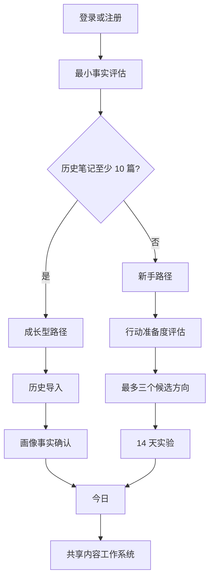
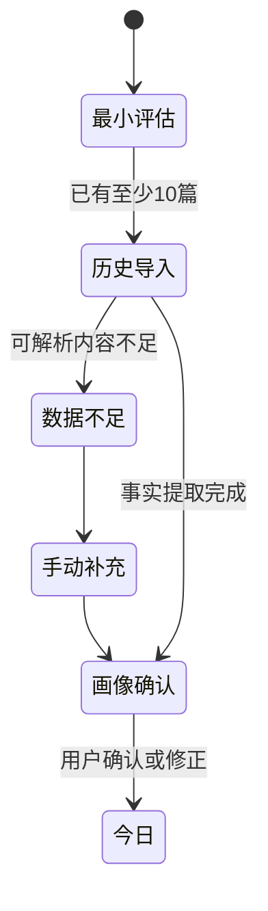
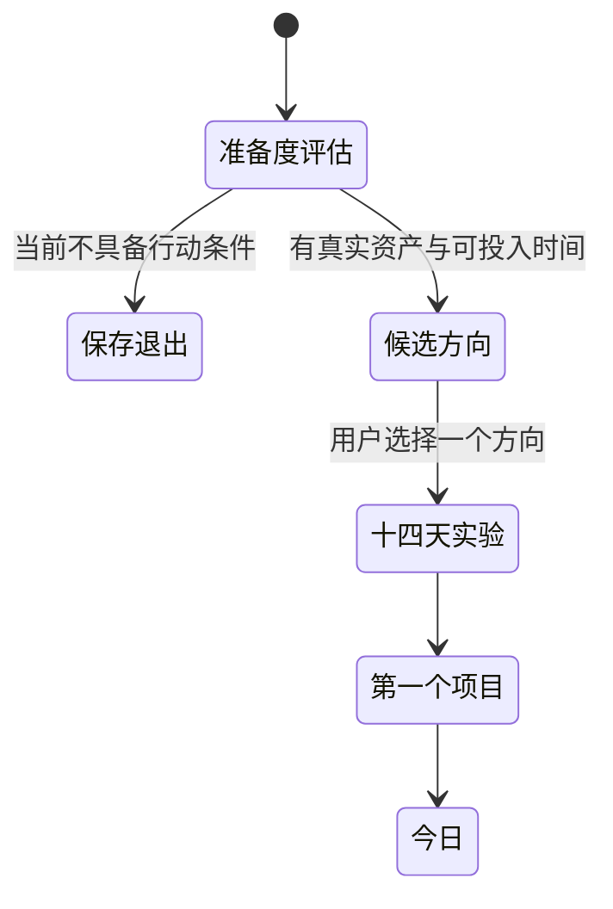

# TopicAI 新版前端信息架构

**版本**：1.0  
**状态**：基于已确认 D1-D9  
**核心原则**：页面按用户任务和内容项目组织，不按 AI 工具组织。

## 1. 产品入口与分流



分流必须允许用户纠正。`starter/growth` 是当前引导路径，不是永久账号标签。

## 2. 一级导航

| 导航 | 用户问题 | 页面职责 | 首版主要对象 |
|---|---|---|---|
| 今日 | 我现在最值得做什么？ | 一个主要 NextBestAction、本周目标、少量可恢复任务 | CreatorState、NextBestAction |
| 内容 | 我的内容进行到哪里？ | 项目组合、周计划、状态、阻塞和实验关系 | ContentProject、Experiment |
| 机会 | 什么值得变成下一篇内容？ | 有来源的候选行动、匹配理由和创建项目 | Opportunity、Evidence |
| 素材 | 我有哪些可证明、可讲述的东西？ | 项目优先素材、来源、去重和引用 | Material、Evidence |
| 我的 | 系统如何理解我，我能控制什么？ | CreatorState、策略、账号、AI 状态、隐私与删除 | CreatorProfile、CreatorState |

## 3. 页面树

```text
公开区
├─ /login                         登录/注册
└─ /onboarding
   ├─ /onboarding/assessment      最小事实与路径判断
   ├─ /onboarding/history         成长型历史导入
   ├─ /onboarding/profile-review  成长型画像确认
   ├─ /onboarding/readiness       新手准备度评估
   ├─ /onboarding/directions      新手候选方向
   └─ /onboarding/sprint          新手 14 天实验

工作区
├─ /today                         今日
├─ /content                       内容项目列表
│  └─ /content/:projectId         内容项目工作台
│     ├─ ?view=overview           概览与时间线
│     ├─ ?view=brief              Brief 与证据采访
│     ├─ ?view=create             创作与版本
│     ├─ ?view=publish            发布检查与记录
│     └─ ?view=review             数据、盲评与 Observation
├─ /opportunities                 机会列表
│  └─ /opportunities/:id          机会详情/创建项目
├─ /materials                     轻量素材列表
│  └─ /materials/:id              来源、引用与隐私
└─ /me                            我的
   ├─ /me/state                   创作者状态
   ├─ /me/strategy                内容策略与周目标
   ├─ /me/account                 小红书账号引用
   ├─ /me/ai                      AI 能力与降级状态
   └─ /me/privacy                 导出、撤销与删除
```

项目内部使用视图参数而不是继续扩张独立工具路由，确保项目上下文不丢失。

## 4. 今日信息结构

```text
页面标题：今天
├─ 本周目标（1-4 篇、已完成、剩余容量）
├─ 主要行动
│  ├─ 动作标题
│  ├─ 为什么是现在
│  ├─ 依据与未知
│  ├─ 预期状态变化
│  ├─ 预计投入
│  ├─ [接受并继续]
│  └─ [暂不做] [手动继续]
├─ 次要任务（最多 3 条）
└─ 最近完成（只显示真实 ActionEvent）
```

没有可执行行动时，首页解释阻塞及恢复方法，不回退为工具菜单或泛化推荐。

## 5. 内容项目信息结构

```text
项目标题 + 状态 + 唯一下一步
├─ 项目时间线
│  ├─ 机会/目标
│  ├─ Brief 与证据
│  ├─ 内容版本
│  ├─ 发布判断/发布版本
│  ├─ 发布记录/数据快照
│  └─ Review/Observation
├─ 当前工作区
│  └─ 只显示当前动作必需的控制
└─ 上下文侧栏/移动端抽屉
   ├─ 目标读者与承诺
   ├─ 证据覆盖
   ├─ 素材引用
   ├─ 未知与风险
   └─ AITrace/HumanGate
```

桌面端可同时看时间线、当前任务和证据；移动端按“当前任务 → 依据 → 历史”顺序折叠。

## 6. 机会信息结构

机会列表默认按“当前可执行性”排序，不按热度排序。

| 区块 | 内容 |
|---|---|
| 来源 | 用户反馈、历史缺口、系列、素材组合、外部事实、Observation 实验 |
| 匹配 | 受众匹配、创作者匹配 |
| 准备 | 素材准备度、证据缺口、预计投入 |
| 作用 | 稳定更新、涨粉验证、系列建设或学习实验 |
| 风险 | 时效、同质化、事实不确定性 |
| 动作 | 查看依据、补证据、创建项目、忽略并说明原因 |

外部热点只能作为一种有来源的 Evidence，不能单独构成推荐理由。

## 7. 两类 onboarding 状态流

### 成长型



### 新手



## 8. 旧路由迁移

| 旧路由 | 新目标 | 规则 |
|---|---|---|
| `/` | `/today` | 登录后统一进入今日 |
| `/topics` | `/opportunities` | 不保留热点模式参数 |
| `/assets` | `/materials` | 保留搜索条件可映射部分 |
| `/profile` | `/me` 或 onboarding | 未完成首次引导时进入 onboarding |
| `/writing`、`/titles` | `/content/:id?view=create` | 无项目上下文则去 `/content` |
| `/publish` | `/content/:id?view=publish` | 必须绑定项目和版本 |
| `/review` | `/content/:id?view=review` | 旧记录只读 |
| `/viral`、`/tracks` | `/opportunities` 或 `/me/strategy` | 移除爆款/竞争度评分 |
| `/analytics` | `/today` | 用户侧不保留泛化大屏 |
| `/accounts` | `/me/account` | 仅一个小红书账号引用 |

## 9. 跨页面上下文规则

1. 从机会创建项目后，保留 `opportunity_id` 和 Evidence 引用。
2. 从今日进入项目，完成动作后返回今日并显示真实状态变化。
3. 项目内切换视图不丢失当前版本、未保存修改和素材抽屉状态。
4. 所有 AI 动作显示依据、限制、门控和手动降级。
5. 深链访问不可用阶段时，解释前置条件并提供最近可执行动作。
6. 移动端底部导航只承载一级切换；项目内部使用顶部返回与视图菜单。

## 10. 首轮实现边界

P0：登录承诺、分流壳层、Today NextBestAction、内容列表、项目工作台。  
P1：Opportunity v2、项目素材抽屉、我的 CreatorState。  
P2：跨项目素材高级搜索、旧记录迁移工具、内部验证指标。

