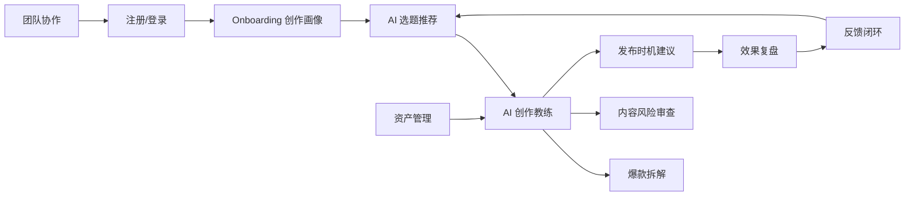
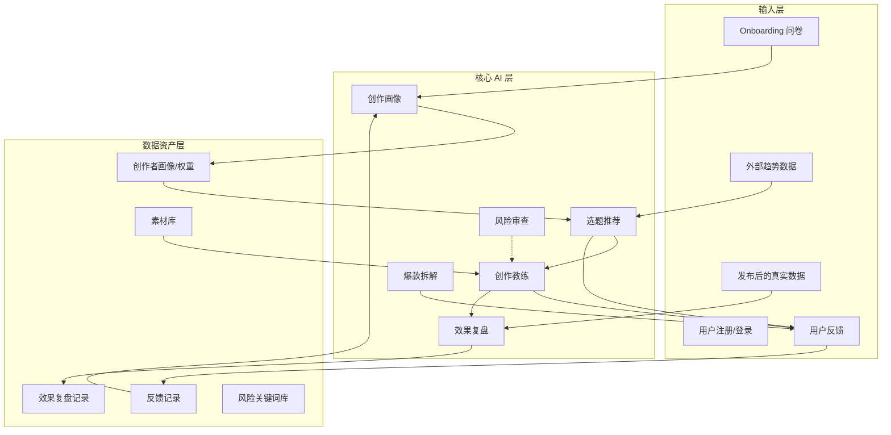

# TopicAI v4.1 产品功能全景文档

> 目的：让你从“产品视角”全盘理解 TopicAI 有哪些功能、每个功能解决什么问题、怎么实现的、模块之间如何耦合。
>
> 约定：正文的功能描述不出现代码与文件路径；最后的“项目结构说明”“API 说明”两个独立板块再列出文件与接口。

---

## 1. 产品一句话定位

TopicAI 是面向内容创作者和团队的 **AI 协创平台**，把“选题、创作、风控、发布、复盘、再推荐”串成一条自动学习的数据闭环。

---

## 2. 功能全景与用户旅程



**核心循环**：创作画像 → 选题推荐 → 创作教练 → 发布/风险审查 → 效果复盘 → 反馈 → 权重更新 → 下一轮选题推荐更懂你。

---

## 3. 功能模块详解

### 3.1 认证与账户体系

**作用**：为所有功能提供身份与权限基础。用户通过邮箱注册/登录，获得访问令牌；平台账号与团队权限在此基础上管理。

**用户场景**：

- 个人创作者登录后查看自己的选题与素材；
- MCN 管理员登录后管理旗下多个平台账号与团队成员。备注：取消并删除团队账号，本产品仅面向个人用户

**实现方式**：

- 邮箱+密码注册登录，密码做安全哈希；
- 签发短时效 access token 与长时效 refresh token，支持无感刷新；
- 平台账号表记录小红书、抖音、B 站等账号的绑定状态与最后同步时间；
- 团队成员表记录角色（admin/viewer/editor 等），在操作账号与资产时做权限校验。

**耦合关系**：

- 所有“写操作”与敏感读操作都依赖认证模块；
- 平台账号是“发布时机建议”与“效果复盘”的输入之一；
- 团队权限覆盖账号、资产、成员管理。

---

### 3.2 Onboarding & 创作者画像

**作用**：让 AI 先理解创作者。通过一次简短的问卷，生成“创作画像”和“评分权重”，后续所有推荐都会按这套偏好排序。
备注：问卷问题需要重新商议，针对已发布有内容的创作者应该支持之间读取内容来进行生成判断，并针对已有内容提出问卷来完善画像
针对新手用户，应该需要通过AI多轮问答来进行判断，并根据后续的创作情况来进行升级优化

**用户场景**：

- 新用户注册后选择赛道、内容形态、制作复杂度、热点偏好；备注：
- 创作者后续在“创作画像”页修改偏好，系统立即生效。

**实现方式**：

- 问卷答案进入画像服务；
- 优先调用大模型生成多维评分权重；
- 若模型不可用，则使用预设的启发式权重表；
- 画像持久化到数据库，所有需要个性化排序的功能都从这里读取权重。

**耦合关系**：

- **输出** → AI 选题推荐、反馈闭环权重更新；
- **输入** → 用户 Onboarding 表单；
- 与“效果复盘”间接相关：复盘结论帮助创作者调整画像，但系统目前不自动改写画像。

---

### 3.3 AI 选题推荐

**作用**：每天为创作者推荐最适合的热点选题，并按个人画像加权排序。
备注：

**用户场景**：

- 创作者早上打开首页，看到 5 条与个人赛道和偏好最匹配的热点；
- 点击“刷新”获得新一批；
- 查看“历史推荐”回顾之前的结果。

**实现方式**：

- 后端维护一个多级数据源调度器，按优先级尝试外部趋势接口、备用接口、大模型模拟、内置基准库；备注：必须标注来源
- 当某一级不可用时，自动降级到下一级，并记录降级原因；
- 拿到候选话题后，用创作者画像中的多维权重计算“综合匹配分”，取 top-K；
- 最近结果会被缓存，用于“历史推荐”。

**耦合关系**：

- **输入** → 创作画像的赛道与权重；
- **输出** → 选题结果可被用户反馈（👍/👎）影响；备注：设置多级用户评分
- **反馈** → 反馈闭环更新权重后，下一次推荐结果会变化；
- 历史推荐只读，不影响排序。

---

### 3.4 AI 创作教练

**作用**：把创作者在某一环节遇到的“半成品”输入，转化为可直接使用的内容建议。包含四个子工具。

#### 3.4.1 想法推进

**作用**：把一句话模糊想法变成结构化的内容方案。

**用户场景**：用户输入“想讲 OpenAI 新模型”，系统输出核心假设、可行性评估、候选标题、内容大纲、发布节奏。

**实现方式**：优先调用大模型生成结构化方案；失败时退回到基于关键词与规则的模板方案。

#### 3.4.2 标题优化

**作用**：为一个已有标题生成多个高点击变体，并给出预估点击率与技巧说明。

**用户场景**：用户写好一个标题，想提升打开率。

**实现方式**：大模型根据原标题与内容摘要生成 3-5 个变体，并标注标题技巧；若模型不可用，则用启发式规则生成常见高点击句式。

#### 3.4.3 赛道诊断

**作用**：评估一个内容赛道的健康度与竞争度，给出细分方向建议。

**用户场景**：用户想进入新赛道，判断是否有空间。

**实现方式**：结合外部数据源与模型推理，输出健康分、竞争度、细分方向；失败时使用内置赛道评分表。

#### 3.4.4 发布时机建议

**作用**：根据平台与内容类型推荐最佳发布时段。

**用户场景**：内容已做好，不知道几点发、周几发。

**实现方式**：大模型结合平台特性与内容类型给出时段建议；失败时返回内置的时段表。

**教练模块的共性与耦合**：

- 四个子工具都遵循“LLM-first + 启发式回退”的统一模式；
- 输出结果都带有 AI 来源标识（模型生成 / 模板回退）；
- 用户可以对教练输出提交反馈，反馈进入反馈闭环；
- 标题优化与想法推进的输出，可被创作者直接用于内容生产；发布时机建议可结合平台账号使用。

---

### 3.5 爆款内容拆解

**作用**：让创作者学习高传播内容的底层结构，把“感觉它很火”变成“知道它为什么火”。

**用户场景**：

- 粘贴一段爆款文案，系统给出病毒传播分、结构分析、可迁移模板、改写建议；
- 上传爆款封面/截图，系统给出视觉结构分析（当前为占位提示）。

**实现方式**：

- 根据输入类型选择文本分析器或图片分析器；
- 文本路径调用大模型做结构化拆解；
- 输出包含病毒分、结构分析、可迁移模板、改写建议、风险提示。

**耦合关系**：

- 可被用户反馈；
- 拆解出的模板可被创作者在“想法推进”中手动复用；
- 与选题推荐相互独立，但共同服务于“找方向”阶段。

---

### 3.6 内容风险预发布审查

**作用**：在内容发布前扫描合规风险，避免因为极限词、医疗夸大、金融诱导等导致限流或处罚。

**用户场景**：

- 用户粘贴正文，系统高亮“100% 治愈”“保本稳赚”等风险表述；
- 给出风险类别、严重等级和修改建议；
- 返回整体风险分，分数越低越安全。

**实现方式**：

- 第一层做关键词扫描，覆盖常见违规与高风险词；
- 当关键词扫描置信度不够高时，再调用大模型做语义级审查；
- 两种结果按 80%/20% 的权重融合，输出最终风险列表与分数；
- 若大模型不可用，仅返回关键词扫描结果，并明确提示“建议人工复核”。

**耦合关系**：

- 独立服务，可被发布流程调用；
- 风险关键词支持全局库与用户级覆盖；
- 与“发布时机建议”在“发布前准备”环节形成互补。

---

### 3.7 反馈闭环与个人化

**作用**：让 TopicAI 不是“一次性建议工具”，而是越用越懂你的系统。

**用户场景**：

- 用户对某个选题、标题、想法点“有用”或“没用”；
- 提交更详细的反馈（采纳/修改后使用/忽略 + 原因）；
- 用了一段时间后，发现推荐更符合自己口味。

**实现方式**：

- 每条反馈都持久化到数据库；
- 新账号有“冷启动保护”：反馈会记录，但不会立即调整权重，避免误伤；
- 账号注册满 7 天且累计反馈达到 5 条后，系统读取最近 30 天反馈；
- 根据反馈方向（强化/探索/微调）计算权重调整量，每次单维度调整有上限，调整后归一化；
- 更新后的权重写回创作者画像，影响下一次选题推荐。

**耦合关系**：

- **输入** → AI 选题推荐、AI 创作教练、爆款拆解的输出；
- **输出** → 更新后的 rubric_weights 被选题推荐读取；
- 反馈历史可被用户审计，也可用于后续模型微调。

---

### 3.8 效果复盘生命周期

**作用**：把“发完内容看数据”变成结构化复盘，帮助创作者沉淀可执行经验。

**用户场景**：

- 发布前：AI 预估播放量、点赞、评论、互动率；
- 发布后：用户回填真实数据，AI 对比预测与实际，给出 3-5 条维度结论；
- 累积多篇后，系统生成“学习报告”，指出稳定优势和常见短板。

**实现方式**：

- 预测阶段调用大模型生成预估数据，失败时使用基于标题/大纲长度的启发式公式；
- 归因阶段把预测与实际对比，调用大模型生成维度结论，失败时使用三轴启发式结论；
- 学习阶段聚合最近 N 篇归因结论，统计高频强弱项；
- 所有数据持久化，避免服务器重启丢失。

**耦合关系**：

- **输入** → 选题、标题、内容大纲、发布后的真实数据；
- **输出** → 学习报告供创作者调整创作策略；
- 与反馈闭环独立，但二者共同构成“创作—反馈—学习”的完整数据资产。

---

### 3.9 资产管理

**作用**：管理创作者的内容素材库，支持分类、标签、使用追踪与存储配额。

**用户场景**：

- 上传封面、视频片段、参考文案；
- 给素材打标签，按类型/标签搜索；
- 查看素材被哪些内容使用过；
- 查看存储空间使用情况。

**实现方式**：

- 素材元数据存入数据库，文件落本地对象存储；
- 通过抽象存储接口实现，未来可无缝替换为云存储；
- 素材与标签多对多关联，支持使用记录追踪。

**耦合关系**：

- 与创作教练独立，但素材可被创作流程引用；
- 与团队协作耦合：素材按 owner 隔离，团队成员按权限访问。

---

### 3.10 团队协作 
备注：删掉这个功能，仅针对个人用户
**作用**：让 MCN、内容工作室或品牌团队能多人共用 TopicAI。

**用户场景**：

- 管理员邀请成员；
- 给成员分配 admin/editor/viewer 角色；
- 移除离职成员；
- 多成员共享素材与平台账号。

**实现方式**：

- 团队关系表记录成员与角色；
- 在账号、资产等模块做 owner 与 role 校验；
- 至少保留一名 admin，防止团队被锁死。

**耦合关系**：

- 覆盖账号管理、资产管理等所有“多用户可见”的模块；
- 不影响个人创作者的独立使用。

---

## 4. 模块耦合与数据流总览



| 依赖关系 | 说明 |
|---|---|
| 创作画像 → 选题推荐 | 选题排序依赖画像权重 |
| 选题推荐 → 创作教练 | 选题是创作教练的输入场景之一 |
| 创作教练 / 选题推荐 → 反馈闭环 | 用户对这些输出点反馈 |
| 反馈闭环 → 创作画像 | 更新权重，影响下一轮推荐 |
| 创作教练 → 效果复盘 | 标题/选题可作为复盘输入 |
| 效果复盘 → 创作者认知 | 学习报告帮助用户调整画像（目前手动） |
| 风险审查 → 发布流程 |  ideally 在发布前调用 |
| 资产管理 → 创作流程 | 素材可被创作时引用 |
| 团队协作 → 账号/资产 | 权限控制覆盖这些模块 |

---

## 5. AI 透明度与降级策略

为了让用户知道每个建议“到底有多可信”，TopicAI 在每个 AI 输出旁都附加了元数据：

- **可信度 confidence**：0-1 分数，越高表示 AI 对结果越有信心；
- **数据来源 data_source**：说明是来自大模型、实时数据源，还是系统内置模板；
- **模型版本 model_version**：当前调用的大模型版本；
- **提示 caveat**：如果是模板或数据兜底，会提示“建议人工复核”。

**降级策略**：

- 所有 LLM 调用都有超时与异常捕获；
- 失败时自动切换到同结构的启发式模板，保证用户仍然能拿到可用结果；
- 选题推荐的多级数据源回退确保即使外部 API 全部不可用，也能返回内置选题；
- 任何降级都不会伪装成“模型生成”，metadata 会明确标识来源。

---

## 6. 安全与隐私

- 密码安全哈希存储；
- 使用 JWT access/refresh token，access token 短时效；
- API 调用有频率限制；
- 用户上传的文案、图片等内容按 90 天生命周期清理；
- 密钥统一通过环境变量管理，不硬编码在代码中。

---

## 7. 项目结构说明

本板块开始列出代码与文件，用于需要了解工程实现的人参考。

### 7.1 后端目录结构

```text
backend/
  main.py                     # FastAPI 应用入口，注册路由与生命周期
  config/                     # 配置：LLM、数据源、环境变量
  app/
    api/v1/                   # REST API 路由层（薄适配器）
      auth.py                 # 认证接口
      profiles.py             # 画像/Onboarding 接口
      topics.py               # 选题推荐与历史接口
      ideas.py                # 想法推进接口
      titles.py               # 标题优化接口
      tracks.py               # 赛道诊断接口
      publish.py              # 发布时机建议接口
      viral.py                # 爆款拆解接口
      feedback.py             # 反馈提交与历史接口
      reviews.py              # 效果复盘接口
      risk_router.py          # 内容风险审查接口
      assets.py               # 资产管理接口
      accounts.py             # 平台账号接口
      team.py                 # 团队协作接口
      health.py               # 健康检查接口
      router.py               # 汇总所有子路由
    services/                 # 业务逻辑层
      onboarding.py           # Onboarding 与画像生成
      creator_profile.py      # 画像 CRUD
      topic_recommend.py      # 选题推荐编排
      topic_history.py        # 选题历史缓存读取
      idea_booster.py         # 想法推进
      title_optimizer.py      # 标题优化
      track_diagnosis.py      # 赛道诊断
      publish_advisor.py      # 发布时机建议
      viral_analysis.py       # 爆款拆解
      content_risk.py         # 内容风险审查
      feedback.py             # 反馈处理与权重调整
      effect_review.py        # 效果复盘服务
      asset_service.py        # 资产管理
      account_service.py      # 平台账号
      team_service.py         # 团队协作
    chains/                   # 复杂 LLM 流程编排
      effect_review_chain.py  # 效果复盘的预测/归因/学习链
    data_sources/             # 数据源适配器
      data_manager.py         # 多级数据源调度器
      tianapi_source.py       # 天行 API 数据源
      bilibili_source.py      # B 站数据源
      llm_source.py           # LLM 模拟数据源
      preloaded_source.py     # 内置基准库
    data/migrations/          # 数据库迁移脚本
      runner.py               # 迁移执行器
      001_bootstrap.sql       # 迁移元信息表
      002_user_feedback.sql   # 反馈表
      003_effect_reviews.sql  # 效果复盘表
      004_risk_keywords.sql   # 风险关键词表
      005_platform_tokens.sql # 平台令牌表（OAuth 基础）
    models/                   # Pydantic 请求/响应模型
    core/                     # 基础设施
      llm.py                  # 多 provider LLM 客户端
      database.py             # 异步数据库连接
      auth.py                 # JWT 鉴权管理
      storage.py              # 对象存储抽象
      rate_limiter.py         # 频率限制
    middleware/               # 认证、错误处理、监控中间件
    prompts/                  # 提示词模板
    tasks/                    # 定时任务：健康检查、备份、清理
  tests/                      # 单元/集成/E2E 测试
```

### 7.2 前端目录结构

```text
frontend/
  src/
    App.tsx                   # 路由与布局入口
    pages/                    # 页面组件
      Home/                   # 首页/选题推荐
      TopicRecommend/         # 选题推荐页
      IdeaBooster/            # 想法推进页
      TitleOptimizer/         # 标题优化页
      TrackDiagnosis/         # 赛道诊断页
      PublishAdvisor/         # 发布时机页
      ViralAnalysis/          # 爆款拆解页
      EffectReview/           # 效果复盘页
      CreatorProfile/         # 创作画像页
      Assets/                 # 资产管理页
      Accounts/               # 平台账号页
      Analytics/              # 数据分析页（当前占位）
      Login/                  # 登录页
    components/               # 公共组件
      ai-badge/               # AI 来源标识、降级提示
      layout/                 # 侧边栏、Header、页面容器
      feedback/               # 反馈弹窗、点赞组件
      common/                 # Loading、EmptyState、ScoreBar 等
    services/api/             # 后端 API 封装
    hooks/                    # useAuth、useFeedback、useApi 等
    store/                    # Zustand 全局状态
    types/                    # TypeScript 类型定义
  e2e/                        # Playwright 端到端测试
```

---

## 8. API 说明

接口统一前缀 `/api/v1`。除健康检查外，大部分接口需要 JWT 鉴权。

### 8.1 健康检查（无需鉴权）

| 方法 | 路径 | 说明 |
|---|---|---|
| GET | `/health` | 系统整体健康状态 |
| GET | `/health/llm` | 各 LLM provider 可用性 |

### 8.2 认证

| 方法 | 路径 | 说明 |
|---|---|---|
| POST | `/auth/register` | 邮箱注册 |
| POST | `/auth/login` | 邮箱登录，返回双 token |
| POST | `/auth/refresh` | 刷新 access token |
| GET | `/auth/me` | 获取当前用户信息 |

### 8.3 创作画像

| 方法 | 路径 | 说明 |
|---|---|---|
| POST | `/profiles/onboarding` | 提交 Onboarding，生成/更新画像 |
| GET | `/profiles/me` | 获取当前用户画像 |
| PUT | `/profiles/me` | 更新画像字段 |

### 8.4 AI 选题推荐

| 方法 | 路径 | 说明 |
|---|---|---|
| GET | `/topics/recommend` | 获取按画像加权排序的选题 |
| POST | `/topics/refresh` | 重新获取一批选题 |
| GET | `/topics/{id}/explain` | 解释某条选题为什么被推荐 |
| GET | `/topics/history` | 查看最近推荐历史 |

### 8.5 AI 创作教练

| 方法 | 路径 | 说明 |
|---|---|---|
| POST | `/ideas/boost` | 想法推进 |
| POST | `/titles/optimize` | 标题优化 |
| POST | `/tracks/diagnose` | 赛道诊断 |
| POST | `/publish/suggest` | 发布时机建议 |

### 8.6 爆款拆解

| 方法 | 路径 | 说明 |
|---|---|---|
| POST | `/viral/analyze` | 分析爆款文案或图片 |
| GET | `/viral/result/{id}` | 查询分析结果状态 |

### 8.7 反馈闭环

| 方法 | 路径 | 说明 |
|---|---|---|
| POST | `/feedback` | 提交反馈（返回 202） |
| GET | `/feedback/analysis` | 已废弃，提示使用 history |
| GET | `/feedback/history` | 查看反馈历史 |

### 8.8 效果复盘

| 方法 | 路径 | 说明 |
|---|---|---|
| POST | `/reviews/predict` | 发布前预测内容数据（返回 201） |
| POST | `/reviews/attribute` | 发布后回填真实数据并归因（返回 201） |
| GET | `/reviews/learnings` | 获取近期学习报告 |
| GET | `/reviews/list` | 列出复盘记录 |

### 8.9 内容风险审查

| 方法 | 路径 | 说明 |
|---|---|---|
| POST | `/risk/check` | 扫描内容合规风险 |

### 8.10 资产管理

| 方法 | 路径 | 说明 |
|---|---|---|
| GET | `/assets` | 列出素材（支持类型/标签/搜索/分页） |
| GET | `/assets/storage` | 获取存储配额使用情况 |
| GET | `/assets/{id}` | 查看单个素材详情 |
| GET | `/assets/{id}/usage` | 查看素材使用记录 |
| POST | `/assets/upload-url` | 创建上传链接（返回 201） |
| PATCH | `/assets/{id}/tags` | 更新素材标签 |
| DELETE | `/assets/{id}` | 删除素材（返回 204） |

### 8.11 平台账号

| 方法 | 路径 | 说明 |
|---|---|---|
| GET | `/accounts` | 列出绑定的平台账号 |
| GET | `/accounts/{id}` | 查看单个账号 |
| POST | `/accounts` | 创建平台账号（返回 201） |
| PATCH | `/accounts/{id}` | 设为默认主账号 |
| DELETE | `/accounts/{id}` | 解绑账号（返回 204） |
| POST | `/accounts/{id}/sync` | 触发账号数据同步（返回 202） |

### 8.12 团队协作

| 方法 | 路径 | 说明 |
|---|---|---|
| GET | `/team/members` | 列出团队成员 |
| POST | `/team/members` | 邀请成员（返回 201） |
| PATCH | `/team/members/{id}` | 修改成员角色 |
| DELETE | `/team/members/{id}` | 移除成员（返回 204） |

---

## 9. 核心数据实体

| 实体 | 作用 | 生命周期 |
|---|---|---|
| 用户 | 账号、密码、登录态 | 注册后长期保留 |
| 创作者画像 | 赛道、形态、权重 | 注册时创建，Onboarding/手动更新 |
| 反馈记录 | 每次 👍/👎/详细反馈 | 永久保留用于审计，30 天内参与权重计算 |
| 效果复盘记录 | 预测、实际数据、归因、学习 | 长期保留 |
| 风险关键词 | 全局词库与用户覆盖 | 全局库随版本更新，用户覆盖即时生效 |
| 平台账号 | 小红书/抖音/B 站等绑定 | 用户手动增删改 |
| 平台令牌 | OAuth token（预留基础） | 90 天刷新周期 |
| 素材 | 文件元数据与标签 | 用户手动删除，按配额管理 |
| 团队成员 | 团队关系与角色 | 管理员增删改 |

---

## 10. 关键设计原则

1. **路由薄、服务厚**：HTTP 层只做参数解析、鉴权、响应封装，业务逻辑全部下沉到服务与链。
2. **Schema 边界校验**：每个请求和响应都有 Pydantic 模型，保证前后端契约稳定。
3. **AI 透明**：每个 AI 输出都带可信度与数据来源，不伪装、不夸大。
4. **启发式兜底**：LLM 失败或超时时，系统必须返回同结构可用结果。
5. **数据回环**：反馈与复盘产生的数据要回流到创作者画像，让系统持续学习。
6. **测试门禁**：后端与前端代码覆盖率均要求 ≥80%，作为合并前置条件。

---

## 11. 推荐阅读顺序

如果你刚接触这个项目，建议按以下顺序建立认知：

1. 先看本文档的“功能全景与用户旅程”；
2. 阅读“功能模块详解”中的 Onboarding、选题推荐、反馈闭环；
3. 看“模块耦合与数据流总览”；
4. 最后翻阅“项目结构说明”与“API 说明”。

这样你就能从“用户能做什么”一路贯通到“代码是怎么组织的”。
