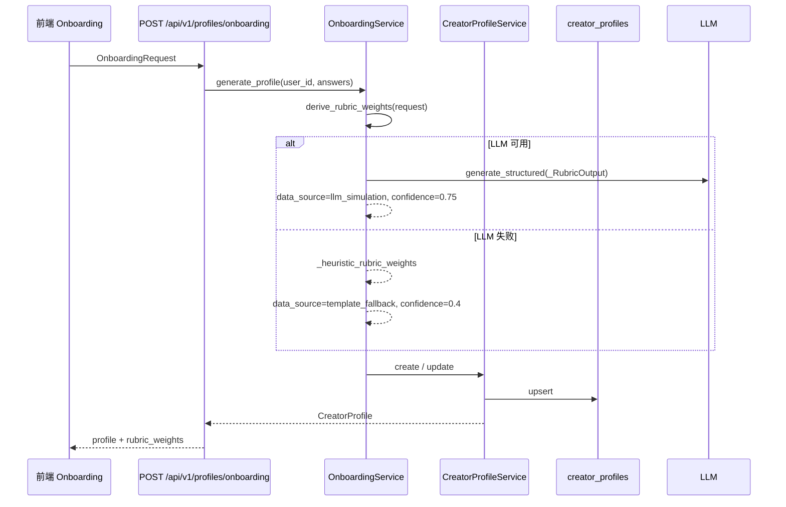
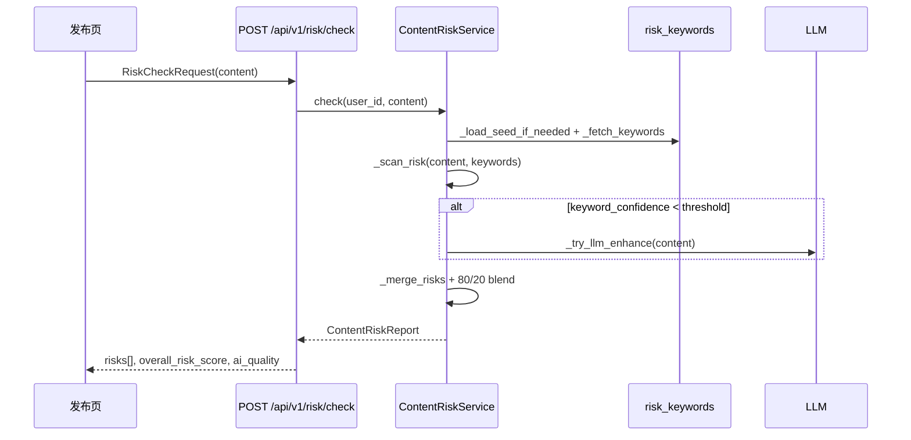
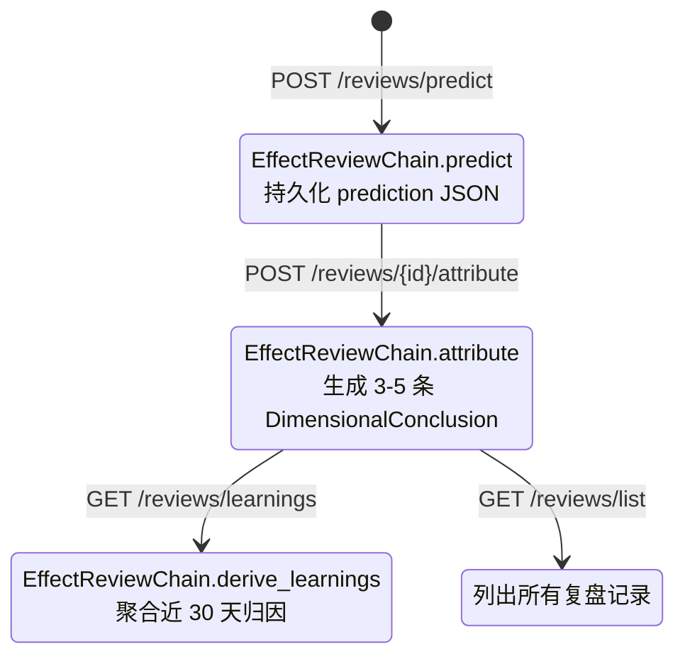
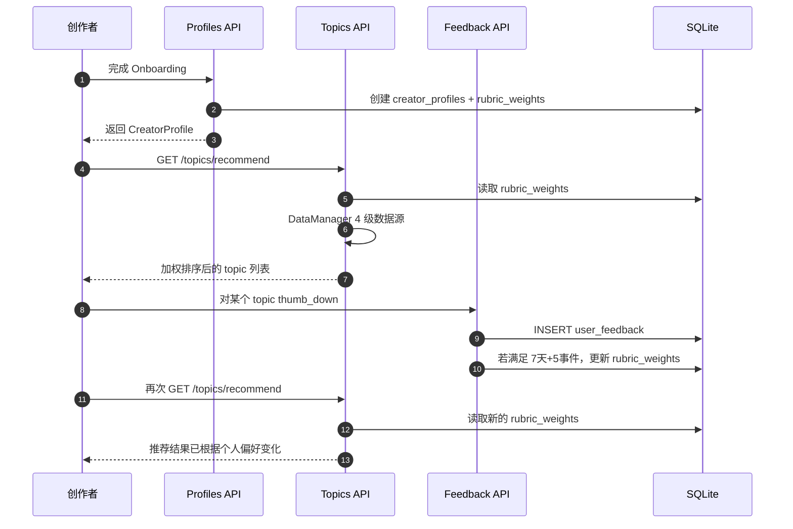

# TopicAI v4.1 产品介绍（技术版）

> 基于 codegraph 对当前仓库（225 个文件、2142 个符号节点）的索引，结合 `specs/007-v4-gap-closure` 的 US1-US7 规划整理。

---

## 1. 产品定位

TopicAI 是面向内容创作者的 **AI 协创平台**，覆盖“选题 → 创作 → 风险审查 → 发布 → 复盘 → 再推荐”的完整闭环。v4.1 的核心目标是：

- 让 advertised 的 AI 能力真正调用 LLM，而不是硬编码模板；
- 通过反馈闭环持续个性化创作者画像；
- 所有 AI 输出都可审计（`confidence / data_source / model_version`）；
- 在数据源或模型不可用时，优雅降级而非 5xx。

---

## 2. 技术架构速览

| 层级 | 技术/模块 | 说明 |
|---|---|---|
| 前端 | React 19 + TypeScript + Zustand | 14 页面、8 侧边栏入口 |
| API 层 | FastAPI + Pydantic | 只负责适配、鉴权、边界校验，业务逻辑下沉 |
| 业务层 | `app/services/` + `app/chains/` | 所有 AI/数据/持久化逻辑 |
| AI 层 | `app/core/llm.py` 的 `LLMClient` | 支持 DeepSeek / Qwen / GLM，结构化输出 + 重试 |
| 数据层 | SQLite + SQLAlchemy async + 迁移 runner | `NNN_topic.sql` 顺序执行，`schema_migrations` 记录版本 |
| 降级原则 | 启发式优先、LLM 增强、4 级数据源回退 | 每个 AI 返回都带 provenance 三元组 |

---

## 3. 功能模块与链路

### 3.1 认证与账户

**功能**：邮箱注册/登录、JWT access+refresh、当前用户信息、平台账号管理、团队协作。

**链路**：

```text
POST /api/v1/auth/register|login
  → AuthManager (backend/app/core/auth.py)
  → 密码哈希 + JWT 签发
  → 返回 access_token / refresh_token

GET /api/v1/auth/me
  → get_current_user dependency
  → 返回用户基本信息

/api/v1/accounts/*  → AccountService (backend/app/services/account_service.py:14)
/api/v1/team/members → TeamService (backend/app/api/v1/team.py:16)
```

**关键文件**：
- `backend/app/api/v1/auth.py:65`（注册/登录）
- `backend/app/services/account_service.py:14`
- `backend/app/services/team_service.py`

---

### 3.2 Onboarding & 创作者画像

**功能**：新用户提交赛道、内容形态、制作复杂度、内容深度、热点偏好后，生成 `CreatorProfile` 与多维 `rubric_weights`，作为后续推荐与个人化的基础。

**链路**：



**关键代码**：
- 端点：`backend/app/api/v1/profiles.py:18`
- LLM 推导权重：`backend/app/services/onboarding.py:163`
- 启发式回退：`backend/app/services/onboarding.py:230`
- 画像 CRUD：`backend/app/services/creator_profile.py`

---

### 3.3 AI 选题推荐（4 级数据源驱动）

**功能**：基于用户赛道与 `rubric_weights`，从多级数据源获取趋势话题，加权排序后返回 top-K，并缓存最近推荐供历史查询。

**链路**：

```text
GET /api/v1/topics/recommend?track=科技
  → TopicRecommendService.recommend_async (backend/app/services/topic_recommend.py:76)
    → DataManager.get_trending_topics (backend/app/data_sources/data_manager.py:96)
      Layer 1  TianAPI      → 失败则 _emit_tier_shift
      Layer 1b Bilibili     → 失败则 _emit_tier_shift
      Layer 2  LLM 模拟     → 失败则 _emit_tier_shift
      Layer 3  Preloaded    → 保底，永不 5xx
    ← 返回 topics + meta(data_source, confidence, model_version, layer)

  → _load_rubric_weights (从 creator_profiles 读取)
  → _rank_topics: composite_score = Σ(dim * weight)
  → _top_k
  → cache_recent_topics
```

**关键特性**：
- 每层降级都会记录 `logger.warning("tier_shift", extra={from_layer, to_layer, reason})`
- `GET /api/v1/topics/history` 读取 `DataManager._recent_cache`
- 始终返回 ≥1 个 topic，数据源透明

**关键文件**：
- `backend/app/services/topic_recommend.py:76`
- `backend/app/data_sources/data_manager.py:96`
- `backend/app/data_sources/preloaded_source.py`

---

### 3.4 AI 创作教练（Idea / Title / Track / Publish）

**功能**：把模糊想法、标题、赛道关键词、平台/内容类型，转化为结构化创作建议。v4.1 统一改为 **LLM-first + 模板回退**。

**统一链路**：

```text
POST /ideas/boost
POST /titles/optimize
POST /tracks/diagnose
POST /publish/suggest
  → 对应 Service
    → _analyze_with_llm()
      → 读取 prompts/*.v1.md
      → LLMClient.generate / generate_structured
      → _clean_json_response 清洗
    alt 成功
      → data_source=llm_simulation, confidence≥0.6
      → model_version=当前 provider 模型
    else 失败/超时/JSON 异常/schema 不符
      → logger.warning
      → _template_*() 启发式回退
      → data_source=template_fallback, confidence≤0.5
```

**关键文件**：
- `backend/app/services/idea_booster.py`
- `backend/app/services/title_optimizer.py:152`
- `backend/app/services/track_diagnosis.py`
- `backend/app/services/publish_advisor.py`
- 端点：`backend/app/api/v1/ideas.py:20`、`titles.py:14`、`tracks.py:14`

**特殊约束**：
- 输入 >5000 字符会先截断；
- 用户输入用 `wrap_user_input` 包裹，防止 prompt 注入。

---

### 3.5 爆款内容拆解

**功能**：输入文本或图片，输出 viral score、结构分析、可迁移模板、改写建议、风险提示。

**链路**：

```text
POST /api/v1/viral/analyze
  → ViralAnalysisService
    → ContentAnalyzerFactory 选择 TextAnalyzer / ImageAnalyzer
    → _analyze_with_llm() 真实调用 LLMClient.generate
    → 返回结构化 ViralAnalysis
```

这是当前代码库中 **最早实现真实 LLM 调用** 的服务。

---

### 3.6 内容风险预发布审查

**功能**：发布前扫描内容合规风险，采用 **80% 关键词扫描 + 20% LLM 增强** 的混合策略。

**链路**：



**关键特性**：
- 首次调用时从 `app/data/seed/risk_keywords.json` 懒加载全局关键词；
- 支持用户级关键词覆盖；
- 内容文本设置 90 天 TTL；
- LLM 失败时单独返回关键词扫描结果，`data_source=keyword_only`。

**关键文件**：
- 端点：`backend/app/api/v1/risk_router.py:28`
- 服务：`backend/app/services/content_risk.py:404`
- 模型：`backend/app/models/risk.py`

---

### 3.7 反馈闭环与个人化

**功能**：用户对 AI 输出点 👍/👎 或提交详细反馈，系统持久化到 `user_feedback`，并在账号“成熟”后根据 30 天滚动窗口调整 `rubric_weights`。

**链路**：

```text
POST /api/v1/feedback
  → FeedbackService.submit (backend/app/services/feedback.py:44)
    → INSERT user_feedback
    → _maybe_update_profile(db, user_id)

_maybe_update_profile:
  1. 检查 users.created_at >= 7 天
  2. 检查反馈事件数 >= 5
  3. 读取 creator_profiles.rubric_weights
  4. 查询近 30 天反馈（ROLLING_WINDOW_DAYS=30）
  5. analyze_feedback → 方向 reinforce/explore/fine_tune
  6. adjust_weights → 单维度 bounded shift ≤ ±0.15，再归一化
  7. CreatorProfileService.update_rubric_weights

GET /api/v1/feedback/history
  → FeedbackService.list_by_user
```

**关键设计**：
- 冷启动保护：新账号反馈仅持久化，不调整权重；
- 并发安全：SQLite 默认隔离足够，PG 环境后续加 `SELECT FOR UPDATE`；
- 老反馈保留用于审计，但计算时排除。

**关键文件**：
- `backend/app/services/feedback.py:44`
- `backend/app/models/feedback.py`

---

### 3.8 效果复盘生命周期

**功能**：发布前预测数据；发布后回填实际数据，生成归因结论；聚合为周期性学习报告。

**链路**：



**关键特性**：
- LLM-first + heuristic fallback；
- `predict` 输出 estimated_views / likes / comments / engagement_rate / caveat；
- `attribute` 输出 3-5 条带 relevance 与 evidence 的维度结论；
- `learnings` 按频率汇总 top strengths / weaknesses。

**关键文件**：
- Chain：`backend/app/chains/effect_review_chain.py:72`
- 服务：`backend/app/services/effect_review.py`
- 端点：`backend/app/api/v1/reviews.py`

---

### 3.9 资产管理与团队协作

**功能**：素材上传、标签、存储配额、使用追踪；团队成员邀请、角色变更、移除。

**链路**：

```text
Assets:
  frontend → /api/v1/assets/*
    → AssetService
    → LocalObjectStorage (backend/app/core/storage.py:32)
    → assets 表 + 本地文件
    → 可平滑替换为 S3/OSS

Team:
  /api/v1/team/members
    → TeamService
    → team_memberships / users 表
```

**关键文件**：
- `backend/app/services/asset_service.py`
- `backend/app/core/storage.py:32`
- `backend/app/api/v1/assets.py`
- `backend/app/api/v1/team.py`

---

### 3.10 可观测性与质量门

**功能**：

| 能力 | 实现 |
|---|---|
| 健康检查 | `GET /health`、`GET /health/llm`（`backend/app/api/v1/health.py:14`） |
| AI 可审计 | 每个 AI 返回都带 `ai_quality: {confidence, data_source, model_version, caveat}` |
| 覆盖率门 | 后端 `pytest --cov=app --cov-fail-under=80`；前端 `pnpm vitest run --coverage` |
| 迁移纪律 | `backend/app/data/migrations/runner.py` 按编号顺序执行，写入 `schema_migrations` |
| 数据生命周期 | 用户内容 90 天 TTL、反馈 30 天滚动计算窗口 |

---

## 4. 端到端示例：从 Onboarding 到下一次推荐



---

## 5. 核心设计原则（Constitution）

1. **Service-Layer Architecture**：业务逻辑只在 `app/services/` 与 `app/chains/`，路由层只做薄适配。
2. **TDD**：Red → Green → Refactor，覆盖率 ≥80%。
3. **AI 透明**：每个 AI 响应都带 `confidence / data_source / model_version`。
4. **Hybrid AI**：启发式优先，LLM 仅用于高价值或低置信度场景。
5. **4 级数据源回退**：TianAPI → Bilibili → LLM → Preloaded，永不裸失败。
6. **Schema 校验边界**：所有请求/响应都通过 Pydantic。
7. **安全与数据最小化**：JWT 鉴权、`.env` 管理密钥、90 天内容 TTL。
