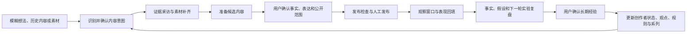

# TopicAI 项目开发全景复盘

> 日期：2026-08-18
>
> 当前仓库：`G:\codex_project\topicAI\mvp`
>
> 当前分支：`main`
>
> 当前提交：`0f3e614abe5469b37ad8fa93b50465989d1749b0`
>
> 证据范围：用户指定的 13 个 Codex 会话、当前 Git 历史、Spec-008 文档、ADR、发布验证、GitHub PR/CI 和本地复验。

## 一、最终结论

TopicAI 已经从一组彼此割裂的 AI 创作工具，重建为一个面向小红书知识/经验型个人创作者的、以 `ContentProject` 为唯一产品聚合的 v2-only 内容操作系统。

项目目前达成的是：

- 技术上完整的本地 MVP。
- 可由 Starter 和 Growth 两种入口进入同一内容项目闭环。
- 在没有 AI 配置时仍可手动完成核心流程。
- 具备版本、证据、发布、表现、复盘、长期经验、隐私和删除边界。
- 经过多轮 TDD、代码审查、安全审计、UX 走查、CI、Playwright 和 Docker 验证。
- 已完全移除公开 `/api/v1` 运行时，OpenAPI 当前有 81 条路径，`/api/v1` 路径为 0。

但必须区分两个概念：

1. **技术 MVP 已完成**：Spec-008 的 155 个任务全部勾选，规格检查 16/16，通过当前测试与 CI。
2. **产品价值尚未被真实市场证明**：尚没有足够真实创作者数据证明留存、持续发布率、复盘完成率或创作效率提升。

因此最准确的定位是：**一个已经完成工程闭环并经过系统加固的本地 MVP，而不是已经完成商业验证的成熟产品。**

## 二、最终完成了什么项目

TopicAI 的最终产品不是“AI 帮用户写一篇文章”，而是一个持续工作的创作闭环：

### 2.1 用户入口

- **Starter**：评估准备度，生成最多三个方向，选择 14 天实验冲刺，建立三个共享 `ContentProject`。
- **Growth**：导入历史内容，逐条查看成功或失败结果，校正并确认创作者画像，然后进入共同的项目工作台。

### 2.2 五个主导航

- 今日：显示唯一主要下一步和次要任务。
- 内容：管理 `ContentProject` 全生命周期。
- 机会：生成、核验、保存、拒绝或采用可解释内容机会。
- 素材：管理文本、链接、图片和文档，并追踪项目引用。
- 我的：维护目标、策略、账号引用、AI 能力状态、数据导出和账户删除。

### 2.3 内容项目闭环

- 三类内容意图：`solve`、`share`、`record`。
- 意图在锁定前可修正，锁定后不覆盖历史事实。
- AI 采访只发现证据缺口，不替用户编造答案。
- 候选内容支持逐段接受、拒绝、替换和恢复。
- 内容版本不可变，草稿恢复与正式版本分离。
- 发布检查绑定具体版本，过期检查和未确认风险不能绕过。
- 发布由用户手工完成，系统只复制、导出、记录链接和时间。
- 表现快照追加写入，缺失指标是 `null`，不是伪造的 0。
- 没有可用指标时，可走 `unavailable -> unknown -> 选择下一步 -> settled` 闭环。
- 只有用户确认的长期洞察进入后续生成上下文。

### 2.4 技术形态

- 后端：FastAPI、Pydantic、SQLAlchemy、SQLite、追加式迁移至 `049`。
- 前端：React 19、TypeScript 6、MUI、Zustand、Vitest、Playwright。
- API：公开运行时只保留 `/api/v2`。
- AI：一个 OpenAI-compatible 边界，运行时不含固定供应商业务逻辑。
- 部署：Windows 主工作树，PowerShell 做普通开发，WSL + Docker 做 Compose 和容器验收。
- 数据：本地 SQLite 和本地对象存储，适合单机 MVP。

## 三、项目演进时间线

| 阶段 | 关键工作 | 结果 |
|---|---|---|
| 1. 意图模型后端 | Spec-010 Step 3/4：工作意图确认、显式 Intent Lock、回溯分类、兼容旧状态、迁移恢复 | PR #15，完整后端门禁通过 |
| 2. 意图模型前端 | Step 5：按意图显示不同判断字段，最多两个辅助响应，独立锁定动作 | PR #16，桌面/移动 QA 和完整前端测试通过 |
| 3. 仓库整理与迁移 | 清理缓存、旧分支和工作树；将有效项目独立迁移到 `G:\codex_project\topicAI` | 新仓库可独立工作，旧目录可删除 |
| 4. 机会采用完整性 | 修复机会采用后 `material_requirements` 未进入项目 | PR #23 合并 |
| 5. 系列模型缺口 | 修复混合系列 scope、`member_intents`、用户覆盖 AI 建议、迁移 037 恢复 | PR #24 合并 |
| 6. 观察窗口 | 发布后等待到期，定时推进复盘，同时允许用户提前主动回填 | PR #25 合并 |
| 7. 无指标闭环 | 支持最终无法取得指标，结果为 unknown，仍可选择下一步并沉淀项目 | PR #26 合并 |
| 8. 状态审计 | 增加 `ProjectStateEvent`，统一真实状态写入并限制公共转换边 | PR #27 合并 |
| 9. Growth onboarding | 历史内容导入、逐条校验、画像证据、修正和确认 | PR #28 合并 |
| 10. Docker 瘦身 | 移除 PyTorch、CUDA、Triton、Transformers、Chroma 等非核心依赖 | PR #29 合并，后端镜像约 9.47 GB 降至约 508 MB |
| 11. 可解释机会 | 多轮审查后补齐来源、八维解释、核验、过期、筛选、反馈和采用闭环 | PR #30 合并 |
| 12. v2-only | 盘点旧数据后删除 v1 运行时、旧页面、固定供应商和空旧表，保留安全升级历史 | PR #31 合并 |
| 13. Spec-008 发布缺口 | 完成发布、截图指标、素材、账户导出/删除、OpenAPI、CI、Docker fresh/upgrade 验证 | PR #32 合并 |
| 14. 全库加固 | 后端安全、迁移风险 ADR、前端 critical/high/medium 审计修复 | PR #33 合并 |
| 15. CI 恢复 | 修复日期边界、Starter 顺序和依赖审计问题 | PR #34 合并 |
| 16. 项目审查 | 修复 3 个后端和 4 个前端真实 bug，形成 UX 证据记录 | PR #35 合并 |
| 17. UX 收尾 | 修复 26 项体验问题和 5 项回归发现，统一中文标签、错误反馈与流程提示 | PR #36 合并 |

## 四、你在项目中做了什么

你承担的不是单纯“提出功能需求”，而是产品负责人、技术决策者和质量门槛拥有者三种角色。

### 4.1 你做出的关键产品决策

1. 将产品从独立 AI 工具集合重构为一个 `ContentProject` 主闭环。
2. 明确创作权属于用户：AI 可以准备、建议、分析，但不能替用户确认事实、公开内容、发布或写入长期经验。
3. 要求内容先确认意图，再采访证据，再形成候选内容。
4. 将内容意图明确分为解决、分享、记录，并拒绝所有内容套用同一“问题-答案”结构。
5. 拒绝假热点、假实时、假概率和自动归因，把机会解释改成定性维度和可检查来源。
6. 要求没有 AI、没有指标、外部服务失败时仍有手动路径，不能把用户卡死。
7. 最终选择 v2-only，并在删除旧版前先盘点真实数据，确认没有旧版业务数据需要迁移。

### 4.2 你建立的工程纪律

1. 反复要求先审查再合并，CI 通过后才进入 `main`。
2. 要求测试先行，重要行为必须有可运行的红绿回归证据。
3. 要求交接文档保存到项目文档，而不是只放临时目录。
4. 要求区分“建议”“实现”“验证”和“合并”，不把计划写成成果。
5. 要求清理仓库、分支、缓存、镜像和卷，但必须先证明对象无用。
6. 要求减少系统提示词，把机器特定的 WSL/Docker 流程下沉到 Skill 和项目级规则。
7. 多次纠正工作区定位、WSL 使用和 CodeGraph 调用方式，最终形成 fail-closed 的仓库根校验规则。

### 4.3 你提出的高价值建议

- 后端和前端 Step 5 分开 PR，降低审查和回滚风险。
- 旧项目 ACL、缓存和 worktree 混乱时，不继续“原地打补丁”，而是建立独立干净仓库再迁移必要资料。
- WSL 不做常驻保活，需要时启动，不用时 `wsl --shutdown`。
- 每个依赖必须有真实生产调用依据，测试工具不得进入生产镜像。
- 全局规则只放通用原则，项目特例留在项目规则或 Skill。
- CodeGraph 原则保持不动，Windows/WSL 的安装特例不能污染全局规则。
- Docker 卷按数据价值分类，当前数据库卷保留，日志和单次验收卷按任务清理，禁止无差别 prune。
- 删除 v1 前先审计实际数据，而不是凭“看起来没用”直接删除。

这些建议直接降低了代码量、镜像体积、误删风险、提示词消耗和后续维护成本。

## 五、共同形成的核心设计决策

### 5.1 领域与产品

- `ContentProject` 是唯一业务聚合，不再以工具页面为产品边界。
- `ContentProject.status` 是当前状态权威，`ProjectStateEvent` 是追加式审计事实，不做事件溯源。
- Today 只突出一个主要下一步，避免仪表盘把决策压力还给用户。
- HumanGate 保护意图、事实、候选版本、发布和长期经验等不可替代决策。
- 发布事实、版本、表现快照、复盘和经验采用均追加写入，不覆盖历史。

### 5.2 AI 边界

- 只使用 OpenAI-compatible 配置边界。
- AITrace 必须记录模型、证据、限制、结果和用户决定。
- 模型输出不是实时事实来源。
- Vision 需要能力声明和部署开关同时开启。
- AI 建议不能直接写入当前版本，必须由用户接受。
- 只有确认的 LearnedInsight 可以进入未来上下文。

### 5.3 平台边界

- 不自动发布，不自动同步小红书指标。
- 允许复制文本、Canvas PNG 导出、手工记录链接和指标。
- 外部链接无法验证时返回 pending/insufficient，不编造验证结果。

### 5.4 工程边界

- 历史 migration 不重写，修复通过追加迁移完成。
- 公共 API 只保留 `/api/v2`。
- 复用认证、数据库、API envelope、风险、反馈、MUI、Zustand 和测试基础。
- 不新增队列、外部数据库、运行时网页研究服务或无调用依据的依赖。
- 普通开发使用 PowerShell；WSL + Docker 仅承担 Compose、全栈和容器验收。

## 六、遇到的主要错误及解决方式

| 错误或风险 | 根因 | 解决方式 | 留下的长期规则 |
|---|---|---|---|
| PowerShell 中文乱码 | 控制台编码错误 | 显式按 UTF-8 读取 | 中文文档和用户文案必须有 UTF-8/mojibake 门禁 |
| 多次 503、403、模型容量或额度失败 | 外部模型服务不可用 | 保留工作状态，稍后继续，不把服务失败当代码失败 | 外部服务失败与仓库结论分离 |
| GitHub token 失效、HTTPS 超时 | 本地认证和网络问题 | 设备登录；必要时使用 GitHub API 或 SSH 临时 fetch | 不改写 Git 配置来掩盖临时网络问题 |
| PR #16 改 base 后出现 39 文件、6 提交 | 后端 PR 被 squash，堆叠分支历史不再等价 | 将唯一前端提交重放到最新 `main`，再 `force-with-lease` | 堆叠 PR 在上游 squash 后必须重放并复核文件清单 |
| pytest 临时目录大量 ACL 错误 | 历史沙箱账户创建的目录不可访问 | 改用项目内明确临时目录；最终迁移到干净仓库 | 测试目录必须可再生，不与业务数据混放 |
| SQLite 迁移重放失败、触发器丢失、重复列 | 表重建、重命名和中断恢复处理不足 | 追加 035/037/040/044/049，恢复索引触发器，补中断恢复测试 | 历史迁移不可修改；新迁移必须可重放、可恢复 |
| 迁移 043 曾被直接修改 | 已执行 migration 不会重新运行，checksum 漂移 | 恢复 043，新增 044 repair migration | 数据修复必须走 additive migration |
| Vitest 长时间无输出或重复进程 | Windows/G 盘首次转换慢、worker 配置和残留进程 | 限制 worker、精确终止残留、单文件复验后跑全量 | 区分环境挂起与断言失败 |
| 临时 Playwright 页面空白 | 通配 mock 把 `/src/...` 模块也拦截成 JSON | 收窄 API 拦截范围 | 测试基础设施也必须经过根因诊断 |
| Growth onboarding CI 竞态 | 先显示导入成功，后到的画像刷新覆盖用户输入 | 先等待画像刷新，再更新完成状态 | 异步状态必须按用户可见顺序提交 |
| 观察窗口被实现为强制禁录期 | 把“自动到期”误解成“禁止提前复盘” | 自动扫描只推进到期项目，用户仍可提前回填 | 领域时间窗不等于用户操作禁令 |
| 无指标时项目无法闭环 | 模型强制至少一个指标 | 增加 unavailable，结果固定 unknown，用户选择下一步后 settled | 未知也是合法结果，不能伪造 0 |
| 机会采用丢失素材需求 | `_ensure_project` 绕过正式意图确认路径 | 复用 `IntentConfirmationService.confirm()` | 共享业务语义必须走正式服务入口 |
| 第一方机会无法采用、来源不可检查 | 初版只完成生成，没有完成决策和来源契约 | 多轮 code review，补 adopt/save/reject、SourceReference、八维解释、过期核验和反馈 | “生成出来”不等于用户流程完成 |
| Docker 后端镜像约 9.47 GB | `sentence-transformers` 间接拉入 PyTorch、CUDA、Triton | 删除非核心 embedding/Chroma，拆分开发依赖 | 依赖必须有生产调用证据 |
| WSL 占用高且常驻 | 保活进程维持整个虚拟机和 Docker | 删除保活，按需启动和 shutdown | 开发工具不能默认常驻消耗资源 |
| WSL `E_ACCESSDENIED` / systemd 警告 | 沙箱用户无注册表权限、冷启动竞态 | 使用真实用户上下文，冷启动串行等待并校验退出码/完成标记 | stderr 警告不能单独判定命令失败 |
| CodeGraph 在 WSL 缺少 Linux Node | WSL 命中 Windows npm shim | 在项目规则中固定用 PowerShell 的 `codegraph.cmd` | 机器特例只写项目规则，不污染全局规则 |
| 错误识别成其他仓库 | 从父目录扫描并选择无关 Git 仓库 | 使用 `git -C <expected-root>` fail-closed 校验 | 禁止扫描兄弟项目替代预期仓库 |
| GitHub Actions 未获得 runner | GitHub 托管 runner 外部故障 | 保留 PR，等待后重跑；不修改无关 YAML | runner 未启动不是代码失败 |
| PR #33 合并后 CI 失败 | 日期边界、Starter 顺序和 nanoid 依赖审计 | PR #34 定向修复并恢复绿灯 | 合并后仍需观察 main push CI |
| SQLite 每个新连接丢失 PRAGMA | 只在单个初始化连接执行 PRAGMA | SQLAlchemy connect listener 对每个连接重放 | 连接级约束必须在连接建立时设置 |
| 创作者规则并发确认污染 active version | 预检在事务外，失败者仍更新指针 | UPDATE 加状态条件并检查 rowcount | 并发状态改变必须原子检查 |
| 登录错误整页刷新、素材删除确认失效、HumanGate 永久转圈 | API 错误元信息被丢弃和错误恢复不足 | 保留 meta、显示重试、只在 refresh 失败时登出 | 错误路径必须是产品流程的一部分 |

## 七、删除了什么，以及为什么删除是正确的

项目曾进行两轮 Ponytail 过度工程审计。删除对象都先验证无生产调用，再删除并跑测试。

主要删除项：

- 无入口的旧工具页面和测试。
- 未使用的 Analyzer 工厂、ObjectStorage 旧实现、Chroma 初始化、隐藏 Header。
- 空壳后台任务和重复 scheduler fallback。
- 只被自身测试调用的 UI 孤岛、重复模型、PromptRegistry 和错误中间件。
- Tailwind/PostCSS 未使用链路和多余依赖。
- PyTorch、CUDA、Triton、Transformers、sentence-transformers、ChromaDB 等非核心生产依赖。
- v1 运行时、旧业务服务、固定供应商代码和空旧业务表。

收益包括：

- 两轮仓库清理累计删除数千行无生产价值代码。
- Docker 后端镜像从约 9.47 GB 降至约 508 MB。
- Ubuntu 虚拟盘曾从约 18.9 GB 压缩至约 4.33 GB。
- 生产依赖与开发依赖边界更清楚。
- CI、审查和维护面显著缩小。

这类删除的核心经验是：**先证明无调用、无数据、无兼容责任，再删除。**

## 八、最终成功与可验证证据

### 8.1 当前仓库

- `main` 与 `origin/main` 同步。
- 当前提交：`0f3e614`。
- 生成本文档前工作树干净；当前只有本文档是新增未跟踪文件。
- 最新 PR：[PR #36](https://github.com/wu908/topicai/pull/36)，已合并。
- PR #36 合并后的 GitHub push CI：[run 32043404255](https://github.com/wu908/topicai/actions/runs/32043404255)，后端和前端 job 均成功。

### 8.2 当前本地复验

- 后端：`360 passed, 1 xpassed`。
- 前端：33 个测试文件，`217 passed`。
- v2 source-integrity：通过。
- UTF-8/mojibake：通过。
- `git diff --check`：通过。
- 本地 pytest 仅出现 `.pytest_cache` ACL 写入警告，不影响测试结果。

### 8.3 最新远端 CI

- 后端：`360 passed, 1 xpassed`。
- 后端覆盖率：`88.12%`，高于 80% 门槛。
- Ruff、mypy、Bandit、v2 source-integrity、UTF-8：通过。
- 前端依赖审计、lint、单元测试、构建：通过。
- Playwright E2E：通过。

### 8.4 规格与发布证据

- Spec-008：155/155 任务完成。
- 规格质量检查：16/16。
- OpenAPI：81 条路径，`/api/v1` 为 0。
- 当前最新 migration：`049_release_audit_batch3.sql`。
- 发布验证曾完成 fresh database、`047 -> 048` upgrade、重启持久化、注册登录、Starter/Growth E2E、桌面与移动布局。
- 历史迁移 critical 风险已记录在 [ADR-003](adr/003-historical-migration-critical-risks.md)，不通过修改历史 SQL 制造新旧库分叉。

## 九、当前项目仍未证明或仍需关注的事项

1. **真实用户验证**：尚未形成真实创作者的长期使用数据。
2. **真实 LLM 端到端验证**：最新 UX 轮次没有配置真实 LLM；无 AI 手动路径已充分验证。
3. **最新 UX 提交后的本地 Docker 复验**：PR #32 做过完整 fresh/upgrade Docker 验证；PR #36 之后的 GitHub CI 全绿，但该 UX 轮次文档明确没有在本地重跑 Docker Compose。
4. **历史 migration 风险**：已有风险不应通过篡改历史 migration 修复，后续只能用追加迁移和审计处理。
5. **低优先级审计债务**：仍有低等级可维护性建议，不是当前功能或安全阻塞项。
6. **`1 xpassed`**：当前不是失败，但说明一个预期失败标记可能已经过期，后续可单独清理。

## 十、建议的下一阶段

### 10.1 产品验证优先于继续扩功能

建议选择 5 到 10 位真实知识/经验型创作者，运行 2 到 4 周受控试用，至少记录：

- 首个项目完成率。
- 从想法到可发布版本的时间。
- 每周持续发布率。
- 表现数据回填率。
- 复盘完成率。
- 建议接受、修改和拒绝比例。
- 用户是否愿意继续使用。

### 10.2 补两项技术验收

- 使用一个真实 OpenAI-compatible 文本模型做 AI Trace、失败降级和证据约束 smoke。
- 使用当前 `main` 再做一次隔离 Docker fresh/upgrade 验证，确认 PR #33 至 #36 的加固没有改变容器发布行为。

### 10.3 暂时不要做的事情

- 不恢复 v1、旧工具页或固定供应商运行时代码。
- 不增加连续热点抓取、自动发布、自动指标同步或预测归因。
- 不为了消除低等级审计项进行大规模重构。
- 不新增没有真实生产调用者的依赖、抽象、队列或数据库。

## 十一、项目最重要的经验

1. 产品重构的关键不是增加更多 AI，而是明确 AI 与用户各自拥有的决策权。
2. “可生成”不是完成，只有生成、检查、决定、失败恢复和后续闭环全部可达，才是产品能力。
3. 未知、失败和不可用不是异常边缘，它们是创作系统的正常状态。
4. 数据迁移的正确性比迁移文件看起来整洁更重要，历史 migration 一旦执行就不能随意修改。
5. 小型本地 MVP 不需要为未来规模预建复杂基础设施。
6. 清理代码和依赖也必须有证据，不能把“没有立刻看到调用”当作删除授权。
7. 交接、固定测试结果、PR 文件边界和 CI 状态，使多会话开发仍然保持可审计。
8. 这次项目真正成功的地方，是把产品判断、领域模型、工程纪律和运行环境逐步收敛到同一套可验证规则中。

## 十二、证据索引

### 12.1 用户指定会话

- `019f94be-8e13-7f62-8a86-2d2b81ab13d3`
- `019f9f5b-3c72-70f2-8e88-29dd52ffaf5c`
- `019fa3d9-7e68-79c3-a239-18b8447425ca`
- `019fb23b-4f53-7833-b806-e38a65b385f7`
- `019fb25e-71df-7ac1-a996-5877e50b1ede`
- `019fb2b6-af8c-72c2-9854-ca24d5aff70b`
- `019fb342-41a3-7db3-a0b4-a228e3d645d6`
- `019fb638-9d48-7e11-b973-643ab36bc5cf`
- `019fb7c5-6643-7c42-9a22-befcc8d2a37c`
- `019fb80d-e877-7670-997e-bbb392e54bc7`
- `019fbc06-4477-72e3-b87d-749137bef578`
- `019fb6b4-7cc0-7d21-8acd-a5a9383be39a`
- `019fd249-fd8f-74a3-a613-a9d6b3e8541c`

### 12.2 当前项目文档

- [Implementation Plan](../specs/008-content-project-mvp/plan.md)
- [Specification](../specs/008-content-project-mvp/spec.md)
- [Research](../specs/008-content-project-mvp/research.md)
- [Data Model](../specs/008-content-project-mvp/data-model.md)
- [Tasks](../specs/008-content-project-mvp/tasks.md)
- [Quickstart](../specs/008-content-project-mvp/quickstart.md)
- [Release Validation](../specs/008-content-project-mvp/release-validation.md)
- [Constitution](../.specify/memory/constitution.md)
- [项目优化记录](项目优化记录-2026-08-16.md)
- [ADR-001](adr/0001-root-publication-work-in-content-intent.md)
- [ADR-002](adr/0002-bound-ai-orchestration-and-learning.md)
- [ADR-003](adr/003-historical-migration-critical-risks.md)
