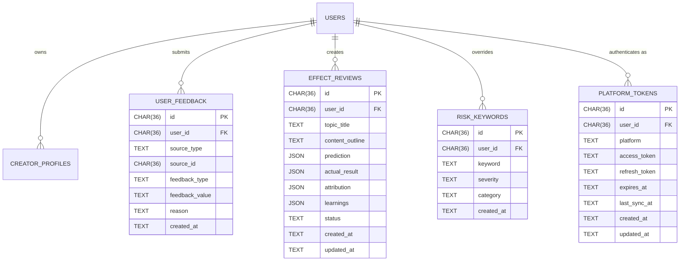

# Data Model: 007 TopicAI v4.1 Implementation-Gap Closure

**Feature**: 007-v4-gap-closure
**Date**: 2026-06-12
**Source spec**: [spec.md](./spec.md)
**Source plan**: [plan.md](./plan.md)

This document captures the new entities introduced by US3-US5 and the
prep entity for the 006-deferred OAuth work. Existing entities
(`users`, `creator_profiles`, `topics`, `viral_decompositions`,
`ideas`, `titles`, `tracks`, `platform_accounts`, `assets`,
`team_members`, `auth_*`) are unchanged unless called out.

## Conventions

- All identifiers are UUIDv4 stored as `CHAR(36)` to match the
  existing convention in `platform_accounts.id` and
  `assets.id`.
- All timestamps use `TIMESTAMP` with UTC normalization;
  created/updated pairs default to `utc_now()` from
  `app/core/utils.py`.
- JSON columns store serialized Pydantic models; deserialization is
  wrapped in `try / except` at the service boundary and degrades to
  `None` with a `logger.warning` (Constitution Principle VII).
- Migration files use the pattern
  `backend/app/data/migrations/NNN_<topic>.sql`
  (NNN = zero-padded sequence, starting at `001_bootstrap.sql`).
  Each migration is idempotent (`IF NOT EXISTS`).
- The migration runner in `backend/app/data/migrations/runner.py`
  records applied migrations in a `schema_migrations` table
  (Quality Gate 8).

## New Entities

### `schema_migrations` (Phase 1)

Migration runner bookkeeping. Tracked by the runner on every apply.

| Column | Type | Notes |
|--------|------|-------|
| version | TEXT PRIMARY KEY | zero-padded sequence string, e.g. `001_bootstrap` |
| applied_at | TEXT NOT NULL | ISO-8601 UTC |
| checksum | TEXT NOT NULL | SHA-256 of the SQL body for tamper detection |

### `user_feedback` (US3)

Persisted feedback events feeding the personalization loop.

| Column | Type | Notes |
|--------|------|-------|
| id | CHAR(36) PK | UUIDv4 |
| user_id | CHAR(36) NOT NULL, FK -> users.id | owner |
| source_type | TEXT NOT NULL | enum: `topic`, `title`, `idea`, `viral`, `track`, `publish`, `effect_review` (matches `SourceType` in `frontend/src/types/enums.ts`) |
| source_id | CHAR(36) NOT NULL | FK to the source row |
| feedback_type | TEXT NOT NULL | enum: `thumb_up`, `thumb_down`, `adopted`, `modified`, `ignored` |
| feedback_value | TEXT NULL | optional 1-5 stars or similar |
| reason | TEXT NULL | optional free text from the detailed dialog |
| created_at | TEXT NOT NULL | default `utc_now()` |

Indexes:
- `idx_user_feedback_user_id_created_at (user_id, created_at DESC)`
  for the `GET /api/v1/feedback/history` query.
- `idx_user_feedback_source (source_type, source_id)` for back-refs.

Service contract: `FeedbackService.submit` is the only writer.
`FeedbackService._maybe_update_profile` is the only consumer of the
last-30-day window.

### `effect_reviews` (US4)

Three-phase lifecycle (predict -> attribute -> derive_learnings)
backed by `EffectReviewService`.

| Column | Type | Notes |
|--------|------|-------|
| id | CHAR(36) PK | UUIDv4 |
| user_id | CHAR(36) NOT NULL, FK -> users.id | owner |
| topic_title | TEXT NOT NULL | denormalized for replay |
| content_outline | TEXT NOT NULL | denormalized for replay |
| prediction | JSON NOT NULL | `PredictionPayload` (`estimated_views`, `estimated_likes`, `estimated_comments`, `engagement_rate`, `caveat`) |
| actual_result | JSON NULL | filled by user T+N days later |
| attribution | JSON NULL | list of `DimensionalConclusion` (`dimension`, `conclusion`, `relevance`, `evidence`) |
| learnings | JSON NULL | cached aggregate; regenerated lazily on `derive_learnings` |
| status | TEXT NOT NULL DEFAULT `awaiting_actuals` | enum: `awaiting_actuals`, `attributed`, `learned` |
| created_at | TEXT NOT NULL | default `utc_now()` |
| updated_at | TEXT NOT NULL | default `utc_now()` |

Indexes:
- `idx_effect_reviews_user_id_created_at (user_id, created_at DESC)`
  for the learning aggregation query.
- `idx_effect_reviews_status (status)` for the
  `GET /api/v1/reviews/list?status=awaiting_actuals` filter.

The 90-day TTL from the Constitution Data Lifecycle section applies:
`expires_at = created_at + 90 days`, set by the same daily purge
task that handles `topics` and `viral_decompositions`.

### `risk_keywords` (US5)

User-extensible keyword library. Global rows have `user_id = NULL`;
per-user overrides are keyed by `user_id`.

| Column | Type | Notes |
|--------|------|-------|
| id | CHAR(36) PK | UUIDv4 |
| user_id | CHAR(36) NULL, FK -> users.id | NULL = global |
| keyword | TEXT NOT NULL | the trigger word/phrase |
| severity | TEXT NOT NULL | enum: `high`, `medium`, `low` |
| category | TEXT NOT NULL | enum: `regulatory`, `sensitive`, `medical`, `financial`, `false_advertising` |
| created_at | TEXT NOT NULL | default `utc_now()` |

Unique constraint: `UNIQUE (user_id, keyword)` -- a user can override
a global keyword's severity but not duplicate it.

Seed data: 100 entries in `backend/app/data/seed/risk_keywords.json`,
loaded by the migration `004_risk_keywords.sql` via `INSERT OR IGNORE`.

### `platform_tokens` (prep for 006 OAuth)

Foundation table for the 006 roadmap's `PlatformOAuthAdapter` work.
Out of scope for 007; created here to avoid a future schema migration
disrupting the 007 release.

| Column | Type | Notes |
|--------|------|-------|
| id | CHAR(36) PK | UUIDv4 |
| user_id | CHAR(36) NOT NULL, FK -> users.id | owner |
| platform | TEXT NOT NULL | enum: `xhs`, `douyin`, `bilibili`, `weibo` |
| access_token | TEXT NOT NULL | encrypted at rest (Constitution Principle XIII) |
| refresh_token | TEXT NULL | encrypted at rest |
| expires_at | TEXT NOT NULL | UTC timestamp; refresh within 7 days of expiry |
| last_sync_at | TEXT NULL | last successful `trigger_sync` |
| created_at | TEXT NOT NULL | default `utc_now()` |
| updated_at | TEXT NOT NULL | default `utc_now()` |

Unique constraint: `UNIQUE (user_id, platform)`.

## Modified Entities

### `creator_profiles` (US3, US6)

Two columns touched:

- `rubric_weights` (JSON): the 7-dim weight map. US3's
  `_maybe_update_profile` writes here. US6's
  `_build_profile_with_llm` seeds this with LLM-derived weights
  instead of 7 equal defaults. Migration is not needed because the
  column already exists; the change is in the writer service.
- `updated_at` (TEXT): bumped on every weight adjustment.

## Index Summary

| Table | Index | Purpose |
|-------|-------|---------|
| `user_feedback` | `(user_id, created_at DESC)` | rolling-30d window, `feedback/history` pagination |
| `user_feedback` | `(source_type, source_id)` | back-ref from topic/title/etc. to feedback |
| `effect_reviews` | `(user_id, created_at DESC)` | learning aggregation |
| `effect_reviews` | `(status)` | `reviews/list?status=...` filter |
| `risk_keywords` | unique `(user_id, keyword)` | override without duplication |

## Retention

| Table | TTL | Purge |
|-------|-----|-------|
| `user_feedback` | 30 days active window for `adjust_weights`; audit retention indefinite (manual) | existing daily task in `app/tasks/` extended to include the 30-day mark for the *active* flag; rows are never deleted, just excluded from math |
| `effect_reviews` | 90 days, matches `topics` / `viral_decompositions` | existing daily task in `app/tasks/cleanup_expired.py` |
| `risk_keywords` | indefinite (curated library) | none |
| `platform_tokens` | until `disconnect`; 7-day refresh window | OAuth refresh task in 006 |

## Backward Compatibility

All new tables are additions. No existing column is altered. The
existing `effect_review` Pydantic model in
`backend/app/models/effect_review.py` already declares
`PredictionPayload`, `DimensionalConclusion`, etc.; the new table
materializes the same Pydantic models as JSON columns (Constitution
Principle VII).

The `user_feedback` table mirrors the `FeedbackRecord` Pydantic
model in `backend/app/models/feedback.py`; the existing
`/api/v1/feedback` endpoint's request schema (`FeedbackSubmitRequest`)
is unchanged, so the frontend is unaffected.

## Schema Drawing (Mermaid)

